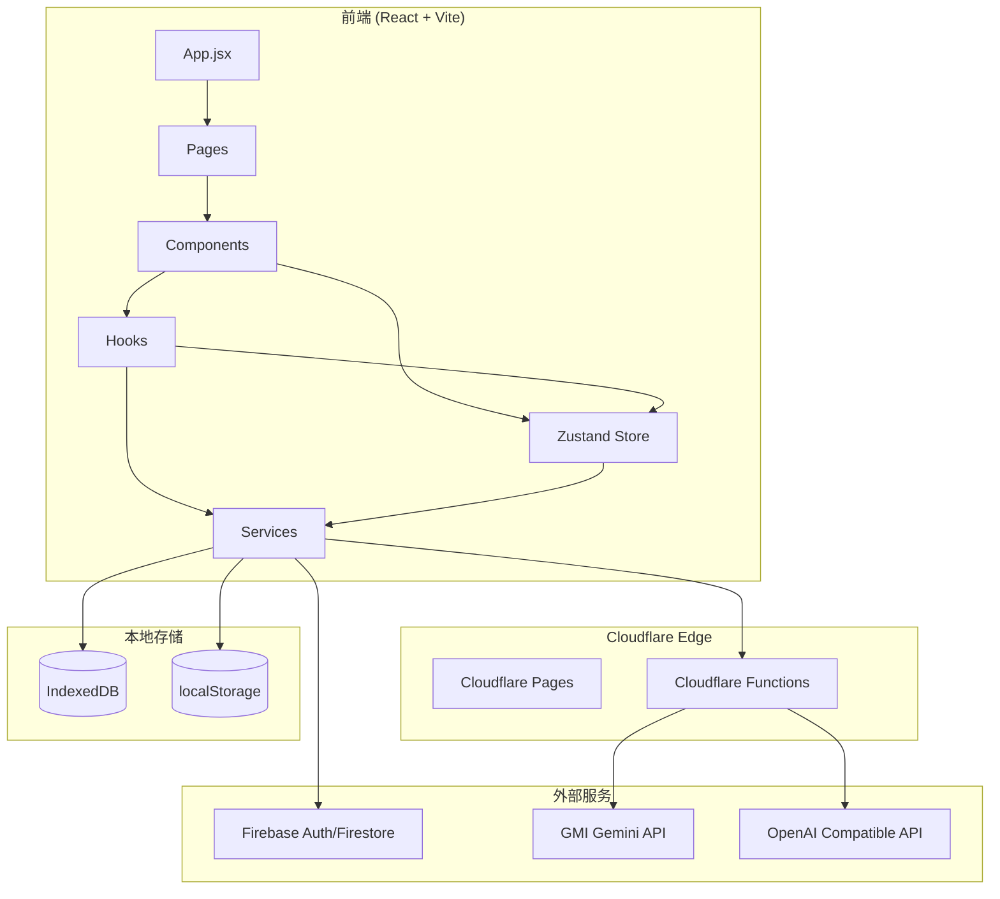
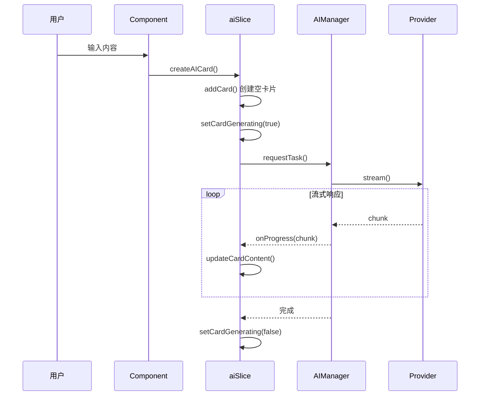
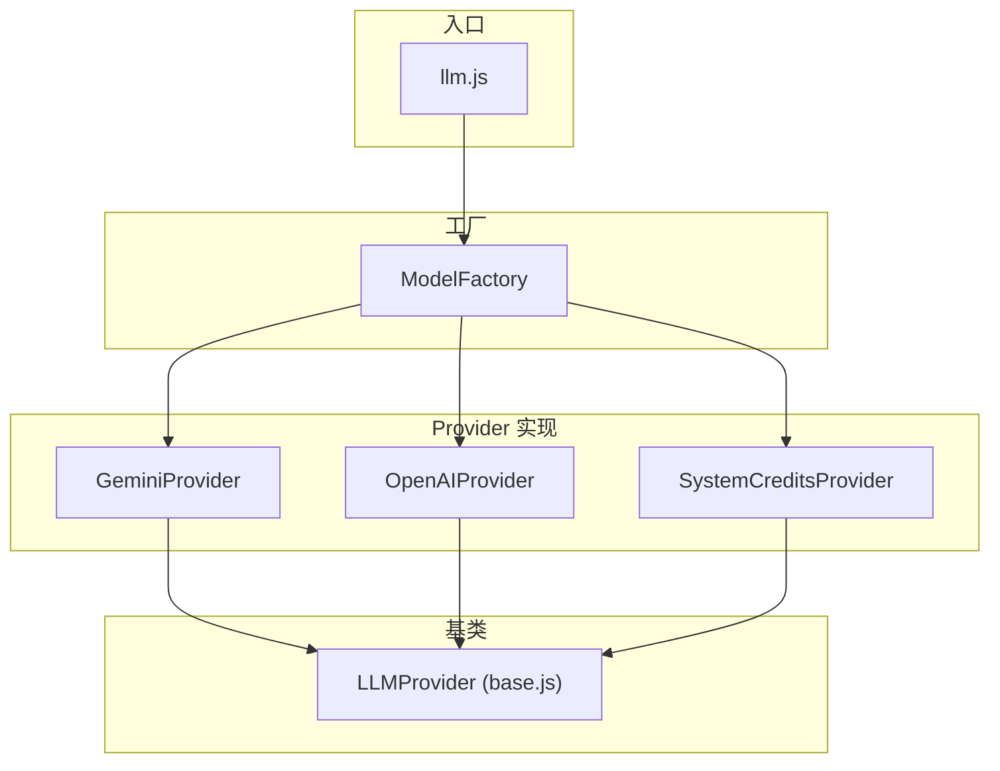
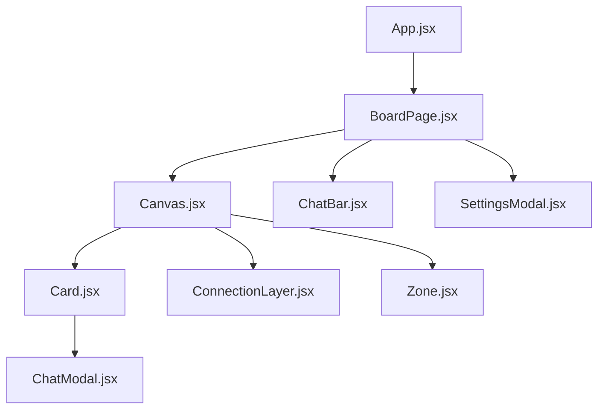
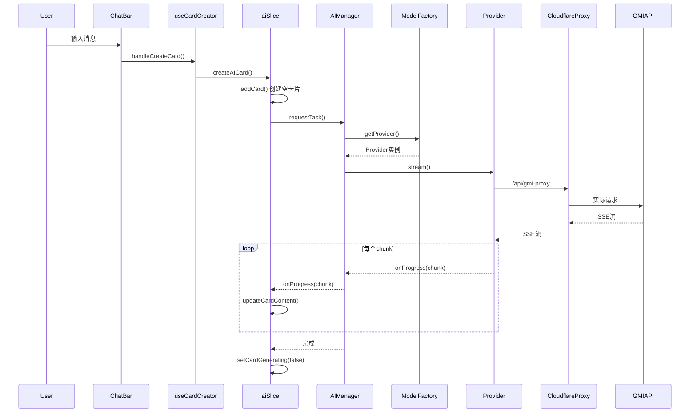
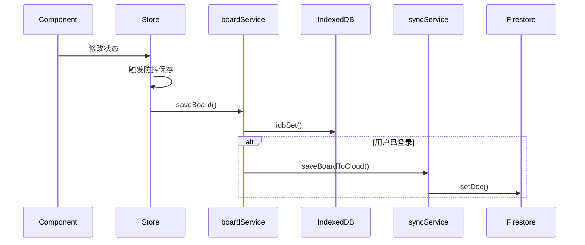
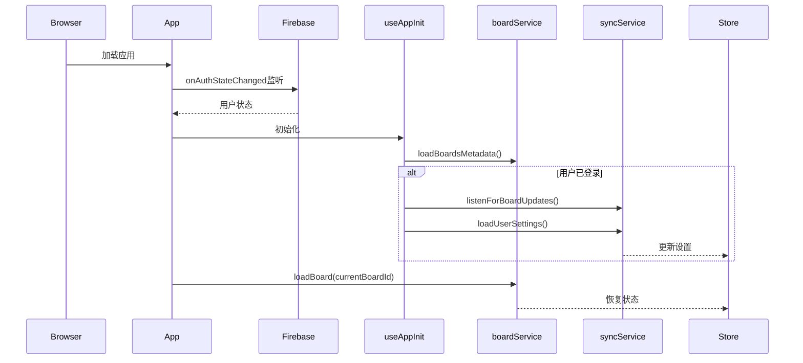

# MixBoard Canvas - 完整代码库文档

> 📚 本文档是为 AI 开发助手和开发人员编写的详细参考手册，涵盖了整个代码库的架构、逻辑流程和关键实现细节。

---

## 目录

1. [项目概述](#1-项目概述)
2. [技术栈](#2-技术栈)
3. [目录结构](#3-目录结构)
4. [核心架构](#4-核心架构)
5. [状态管理 (Store)](#5-状态管理-store)
6. [服务层 (Services)](#6-服务层-services)
7. [组件系统 (Components)](#7-组件系统-components)
8. [自定义 Hooks](#8-自定义-hooks)
9. [API 端点 (Cloudflare Functions)](#9-api-端点-cloudflare-functions)
10. [数据流](#10-数据流)
11. [关键业务逻辑详解](#11-关键业务逻辑详解)
12. [部署与开发命令](#12-部署与开发命令)
13. [常见问题与注意事项](#13-常见问题与注意事项)

---

## 1. 项目概述

MixBoard Canvas 是一个基于 AI 的可视化白板应用，允许用户：
- 🗣️ 与 AI 进行对话，生成卡片形式的回复
- 🎨 在无限画布上组织和连接多个对话卡片
- 🔗 建立卡片间的连接关系，形成知识网络
- 📤 支持多 AI 服务商配置 (Gemini, OpenAI Compatible)
- ☁️ Firebase 云同步用户数据
- 🎁 为无 API Key 用户提供免费额度系统

---

## 2. 技术栈

| 类别 | 技术 |
|------|------|
| **前端框架** | React 18 + Vite |
| **状态管理** | Zustand (Slices 模式) + Zundo (撤销/重做) |
| **样式** | Tailwind CSS |
| **路由** | React Router DOM v7 |
| **认证** | Firebase Auth (Google 登录) |
| **数据库** | Firebase Firestore + IndexedDB (本地) |
| **动画** | React Spring + @use-gesture/react |
| **部署** | Cloudflare Pages + Cloudflare Functions |
| **包管理** | npm |

---

## 3. 目录结构

```
/Users/kang/Documents/AICode/aimainmap/
├── src/
│   ├── App.jsx                  # 应用入口，路由配置，认证逻辑
│   ├── main.jsx                 # React 挂载点
│   ├── index.css                # 全局样式
│   │
│   ├── components/              # UI 组件 (27个)
│   │   ├── Canvas.jsx           # 核心：无限画布
│   │   ├── Card.jsx             # 对话卡片 (收起状态)
│   │   ├── ChatBar.jsx          # 底部输入栏
│   │   ├── ChatModal.jsx        # 卡片展开的聊天模态框
│   │   ├── ConnectionLayer.jsx  # 卡片连线渲染
│   │   ├── SettingsModal.jsx    # 设置面板
│   │   ├── WelcomeCanvas.jsx    # 欢迎/引导界面
│   │   ├── Zone.jsx             # 分组区域
│   │   ├── BoardGallery.jsx     # 画板列表
│   │   ├── FavoritesGallery.jsx # 收藏夹
│   │   ├── StickyNote.jsx       # 便签
│   │   │
│   │   ├── chat/                # 聊天相关子组件
│   │   ├── settings/            # 设置相关子组件
│   │   └── share/               # 分享相关子组件
│   │
│   ├── store/                   # Zustand 状态管理
│   │   ├── useStore.js          # 入口：组合所有 Slices
│   │   └── slices/
│   │       ├── aiSlice.js       # AI 生成状态
│   │       ├── canvasSlice.js   # 画布状态 (缩放/平移)
│   │       ├── cardSlice.js     # 卡片 CRUD
│   │       ├── connectionSlice.js # 连线管理
│   │       ├── groupSlice.js    # 分组/Zone
│   │       ├── selectionSlice.js# 选中状态
│   │       ├── settingsSlice.js # 用户设置
│   │       ├── creditsSlice.js  # 系统额度
│   │       └── shareSlice.js    # 分享状态
│   │
│   ├── services/                # 业务逻辑层
│   │   ├── llm.js               # LLM 统一入口
│   │   ├── llm/                 # LLM 子模块
│   │   │   ├── factory.js       # Provider 工厂
│   │   │   ├── registry.js      # 默认配置
│   │   │   ├── providers/       # 具体 Provider 实现
│   │   │   │   ├── base.js      # 抽象基类
│   │   │   │   ├── gemini.js    # Gemini 协议
│   │   │   │   ├── openai.js    # OpenAI 协议
│   │   │   │   └── systemCredits.js # 系统额度代理
│   │   │   └── utils.js         # 工具函数
│   │   │
│   │   ├── ai/
│   │   │   ├── AIManager.js     # AI 任务队列管理器
│   │   │   └── promptUtils.js   # Prompt 工具
│   │   │
│   │   ├── boardService.js      # 画板 CRUD
│   │   ├── syncService.js       # Firebase 云同步
│   │   ├── storage.js           # localStorage 封装
│   │   ├── firebase.js          # Firebase 初始化
│   │   ├── db/indexedDB.js      # IndexedDB 封装
│   │   ├── imageStore.js        # 图片存储
│   │   ├── favoritesService.js  # 收藏服务
│   │   ├── clearAllUserData.js  # 登出清理
│   │   └── systemCredits/       # 系统额度服务
│   │
│   ├── hooks/                   # 自定义 Hooks
│   │   ├── useCardCreator.js    # 卡片创建逻辑
│   │   ├── useAISprouting.js    # AI 话题扩展
│   │   ├── useCanvasGestures.js # 画布手势
│   │   ├── useDraggable.js      # 拖拽逻辑
│   │   ├── useSelection.js      # 选中框逻辑
│   │   ├── useGlobalHotkeys.js  # 全局快捷键
│   │   ├── useImageUpload.js    # 图片上传
│   │   ├── useBoardBackground.js# 背景图
│   │   └── useAppInit.js        # 应用初始化
│   │
│   ├── pages/
│   │   ├── BoardPage.jsx        # 主画板页面
│   │   └── NotePage.jsx         # 单卡片全屏页
│   │
│   ├── utils/                   # 工具函数
│   │   ├── autoLayout.js        # 自动布局算法
│   │   ├── geometry.js          # 几何计算
│   │   ├── format.js            # 格式化
│   │   ├── uuid.js              # ID 生成
│   │   ├── debugLogger.js       # 调试日志
│   │   ├── graphUtils.js        # 图遍历
│   │   └── routing.js           # 路由工具
│   │
│   ├── contexts/                # React Context
│   │   └── LanguageContext.jsx  # 多语言
│   │
│   └── modules/                 # 功能模块
│       └── landing/             # 落地页
│
├── functions/                   # Cloudflare Functions (API)
│   └── api/
│       ├── gmi-proxy.js         # GMI API 代理
│       ├── system-credits.js    # 系统额度 API
│       ├── image-gen.js         # 图片生成代理
│       └── image-proxy.js       # 图片代理
│
├── public/                      # 静态资源
├── dist/                        # 构建输出
└── package.json                 # 项目配置
```

---

## 4. 核心架构

### 4.1 架构图



### 4.2 数据流概述

1. **用户交互** → 触发组件事件
2. **组件** → 调用 Hooks 或 Store Actions
3. **Store Actions** → 更新状态 & 调用 Services
4. **Services** → 
   - 本地：IndexedDB / localStorage
   - 远程：Firebase / Cloudflare Functions
5. **Cloudflare Functions** → 代理 AI 请求，保护 API Key

---

## 5. 状态管理 (Store)

### 5.1 入口文件：`useStore.js`

```javascript
// 关键特性：
// 1. 使用 Zundo temporal middleware 实现撤销/重做
// 2. 组合 9 个 Slices
// 3. 限制历史记录 50 步
// 4. 只持久化 cards, connections, groups 到历史

const useStoreBase = create(
    temporal(
        (set, get) => ({
            ...createCanvasSlice(set, get),
            ...createCardSlice(set, get),
            ...createConnectionSlice(set, get),
            // ... 其他 slices
            
            // 全局重置 (登出时调用)
            resetAllState: () => { /* 调用各 slice 的 reset */ }
        }),
        {
            limit: 50,
            partialize: (state) => ({
                cards: state.cards,
                connections: state.connections,
                groups: state.groups
            })
        }
    )
);

// 导出 undo, redo 供全局使用
export const { undo, redo, clear: clearHistory } = useStoreBase.temporal.getState();
```

### 5.2 Slices 详解

#### 5.2.1 `cardSlice.js` - 卡片管理

**状态：**
```javascript
{
    cards: [],              // 所有卡片数组
    expandedCardId: null,   // 当前展开的卡片 ID
    lastSavedAt: null       // 最后保存时间
}
```

**核心 Actions：**
| Action | 描述 |
|--------|------|
| `addCard(card)` | 添加新卡片 |
| `updateCard(id, updater)` | 更新卡片 (部分更新) |
| `updateCardFull(id, updater)` | 完整更新 (用于重构后的组件) |
| `deleteCard(id)` | 删除卡片 (同时删除关联连线) |
| `arrangeCards()` | 自动布局 (树形/网格) |
| `handleCardMove(id, x, y, moveWithConnections)` | 卡片移动 |
| `resetCardState()` | 重置状态 |

**卡片数据结构：**
```javascript
{
    id: 'uuid',
    x: 0, y: 0,           // 画布位置
    type: 'conversation', // 'conversation' | 'sticky'
    data: {
        messages: [       // 对话消息列表
            { role: 'user' | 'assistant', content: '...' }
        ],
        marks: [],        // 标记的话题 (用于扩展)
        model: '...',     // 使用的模型
        provider: '...'   // 使用的 Provider
    }
}
```

#### 5.2.2 `aiSlice.js` - AI 生成

**状态：**
```javascript
{
    generatingCardIds: new Set(),  // 正在生成的卡片 ID 集合
    // ... 其他
}
```

**核心 Actions：**
| Action | 描述 |
|--------|------|
| `createAICard(params)` | 创建新 AI 卡片并开始生成 |
| `handleChatGenerate(cardId, messages, onToken)` | 处理聊天生成 |
| `updateCardContent(id, chunk)` | 流式更新卡片内容 |
| `setCardGenerating(id, isGenerating)` | 设置生成状态 |
| `handleRegenerate()` | 重新生成选中卡片 |
| `toggleFavorite(cardId, messageIndex, content)` | 收藏消息 |

**AI 卡片创建流程：**


#### 5.2.3 `canvasSlice.js` - 画布状态

**状态：**
```javascript
{
    offset: { x: 0, y: 0 },  // 画布偏移
    scale: 1,                 // 缩放比例
    selectedIds: [],          // 选中的卡片 IDs
    interactionMode: 'none',  // 'none' | 'pan' | 'select'
    selectionRect: null,      // 框选矩形
    isConnecting: false,      // 是否正在连接
    connectionStartId: null,  // 连接起点卡片 ID
    isBoardLoading: false     // 画板加载中
}
```

**核心 Actions：**
| Action | 描述 |
|--------|------|
| `setOffset(val)` | 设置画布偏移 |
| `setScale(val)` | 设置缩放 |
| `focusOnCard(cardId)` | 平滑聚焦到指定卡片 |
| `toCanvasCoords(viewX, viewY)` | 视口坐标转画布坐标 |
| `restoreViewport(viewport)` | 恢复视口状态 |

#### 5.2.4 `settingsSlice.js` - 用户设置

**状态：**
```javascript
{
    providers: {           // AI 服务商配置
        'google': {
            id: 'google',
            name: 'GMI Gemini',
            baseUrl: 'https://api.gmi-serving.com/v1',
            apiKey: '',
            model: 'google/gemini-3-pro-preview',
            protocol: 'gemini',
            roles: {
                chat: '...',
                analysis: '...',
                image: '...'
            }
        },
        // 可添加更多 provider
    },
    activeId: 'google',    // 当前激活的 provider
    isSettingsOpen: false  // 设置面板是否打开
}
```

**核心 Actions：**
| Action | 描述 |
|--------|------|
| `updateProviderConfig(id, updates)` | 更新 Provider 配置 |
| `setActiveProvider(id)` | 切换激活的 Provider |
| `getActiveConfig()` | 获取当前 Provider 配置 |
| `getRoleModel(role)` | 获取指定角色的模型名 |
| `setFullConfig(config)` | 设置完整配置 (云同步用) |

**持久化：** 使用 `localStorage` key `mixboard_providers_v3`

#### 5.2.5 `connectionSlice.js` - 连线管理

**状态：**
```javascript
{
    connections: [         // 连线数组
        { from: 'cardId1', to: 'cardId2' }
    ],
    isConnecting: false,
    connectionStartId: null
}
```

**核心 Actions：**
| Action | 描述 |
|--------|------|
| `handleConnect(targetId)` | 开始/完成连接 |
| `getConnectedCards(startId)` | 获取连接的卡片网络 |
| `setConnections(val)` | 直接设置连线 |

#### 5.2.6 `creditsSlice.js` - 系统额度

**状态：**
```javascript
{
    systemCredits: null,        // null=未加载, number=当前额度
    systemCreditsLoading: false,
    systemCreditsError: null,
    isSystemCreditsUser: false  // 是否免费用户
}
```

**核心 Actions：**
| Action | 描述 |
|--------|------|
| `loadSystemCredits()` | 从服务器加载额度 |
| `updateCreditsFromResponse(info)` | AI 响应后更新额度 |
| `hasCredits()` | 检查是否有剩余额度 |
| `getCreditsPercentage()` | 获取额度百分比 |

#### 5.2.7 `groupSlice.js` - 分组/Zone

**状态：**
```javascript
{
    groups: [
        {
            id: 'uuid',
            title: 'Zone Name',
            cardIds: ['card1', 'card2'],
            color: 'blue'
        }
    ]
}
```

**核心 Actions：**
| Action | 描述 |
|--------|------|
| `createGroup(cardIds, title)` | 创建分组 |
| `updateGroup(id, updater)` | 更新分组 |
| `deleteGroup(id)` | 删除分组 |
| `addConnectedCardsToZone(id1, id2)` | 连接时自动扩展分组 |

---

## 6. 服务层 (Services)

### 6.1 LLM 服务架构



#### 6.1.1 `llm.js` - 统一入口

```javascript
// 主要导出函数：

// 1. 聊天补全 (非流式)
export async function chatCompletion(messages, config, model = null, options = {})

// 2. 流式聊天 (主对话用)
export async function streamChatCompletion(messages, config, onToken, model = null, options = {})

// 3. 图片生成
export async function imageGeneration(prompt, config, model = null, options = {})

// 4. 生成后续话题 (分析角色)
export async function generateFollowUpTopics(messages, config, model = null, options = {})
```

#### 6.1.2 `factory.js` - Provider 工厂

```javascript
export class ModelFactory {
    static getProvider(config, options = {}) {
        // 1. 无 API Key → SystemCreditsProvider (免费试用)
        if (!hasApiKey && !options.skipSystemCredits) {
            return new SystemCreditsProvider();
        }
        
        // 2. 根据协议选择 Provider
        switch (config.protocol) {
            case 'gemini': return new GeminiProvider(config);
            case 'openai': return new OpenAIProvider(config);
            default: return new OpenAIProvider(config);
        }
    }
    
    static shouldUseSystemCredits(config) {
        return !config?.apiKey || config.apiKey.trim() === '';
    }
}
```

#### 6.1.3 `providers/gemini.js` - Gemini 原生协议

**特点：**
- 支持 Gemini 原生 API 格式
- 支持多模态 (文本 + 图片)
- 支持 Google Search 工具
- 支持流式响应
- 图片生成使用专门的模型

**关键方法：**
```javascript
class GeminiProvider extends LLMProvider {
    // 消息格式转换 (OpenAI → Gemini)
    formatMessages(messages) { /* ... */ }
    
    // 非流式聊天
    async chat(messages, model, options = {}) { /* ... */ }
    
    // 流式聊天
    async stream(messages, onToken, model, options = {}) {
        // 1. 构造 tools (Google Search)
        // 2. 通过 Cloudflare Proxy 请求
        // 3. 解析 SSE 流
        // 4. 处理 functionCall 和 text 响应
    }
    
    // 图片生成 (GMI Cloud)
    async generateImage(prompt, model, options = {}) { /* ... */ }
}
```

#### 6.1.4 `providers/openai.js` - OpenAI Compatible

**特点：**
- 兼容所有 OpenAI 格式 API
- 支持自定义 baseUrl
- 支持 DALL-E 和 Gemini 风格图片生成

#### 6.1.5 `providers/systemCredits.js` - 免费额度

**特点：**
- 无需用户 API Key
- 通过 Cloudflare Function 代理
- 自动计算 Token 消耗
- 扣除用户额度

### 6.2 `AIManager.js` - 任务队列

```javascript
// 优先级定义
export const PRIORITY = {
    CRITICAL: 3,  // 用户直接等待 (如 Modal Chat)
    HIGH: 2,      // 可见 UI 更新 (如卡片生成)
    LOW: 1        // 后台任务
};

// 任务状态
export const STATUS = {
    PENDING: 'pending',
    RUNNING: 'running',
    COMPLETED: 'completed',
    FAILED: 'failed',
    CANCELLED: 'cancelled'
};

class AIManager {
    constructor() {
        this.queue = [];           // 待执行任务队列
        this.activeTasks = new Map(); // 正在执行的任务
        this.maxConcurrent = 3;    // 最大并发数
    }
    
    // 提交任务
    async requestTask({ type, priority, payload, tags, onProgress }) {
        // 1. 取消队列中冲突的任务 (按 tags 匹配)
        // 2. 创建任务对象
        // 3. 加入队列并排序
        // 4. 触发队列处理
        // 5. 返回 Promise
    }
    
    // 队列处理
    _processQueue() {
        // 按优先级排序取任务
        // 并发控制
    }
    
    // 执行任务
    async _executeTask(task, signal) {
        // 根据 type 调用对应的 LLM 方法
        // type: 'chat' | 'image'
    }
}

// 单例导出
export const aiManager = new AIManager();
```

### 6.3 `boardService.js` - 画板服务

```javascript
// 存储 Key 常量
const BOARD_PREFIX = 'mixboard_board_';
const BOARDS_LIST_KEY = 'mixboard_boards_list';
const CURRENT_BOARD_ID_KEY = 'mixboard_current_board_id';

// 主要函数

// 画板元数据管理
export function getCurrentBoardId() { /* localStorage */ }
export function setCurrentBoardId(id) { /* localStorage */ }
export async function getBoardsList() { /* 过滤已删除 */ }
export async function getTrashBoards() { /* 回收站 */ }
export async function loadBoardsMetadata() { /* IndexedDB */ }

// CRUD
export async function createBoard(name) {
    // 1. 生成 ID
    // 2. 创建元数据 { id, name, createdAt, updatedAt }
    // 3. 存入 IndexedDB
    // 4. 更新画板列表
}

export async function saveBoard(id, data) {
    // 1. 存入 IndexedDB (带时间戳)
    // 2. 更新列表元数据
}

export async function loadBoard(id) {
    // 1. 从 IndexedDB 加载
    // 2. 处理旧格式数据迁移
    // 3. 处理图片 base64 恢复
    // 4. 返回 { cards, connections, groups, background }
}

// 软删除/恢复/永久删除
export async function deleteBoard(id) { /* 标记 deletedAt */ }
export async function restoreBoard(id) { /* 清除 deletedAt */ }
export async function permanentlyDeleteBoard(id) { /* 彻底删除 */ }

// 视口状态
export function saveViewportState(boardId, viewport) { /* localStorage */ }
export function loadViewportState(boardId) { /* localStorage */ }
```

### 6.4 `syncService.js` - 云同步

```javascript
// --- 实时监听 ---
export function listenForBoardUpdates(userId, onUpdate) {
    // 1. 监听 Firestore 用户画板集合
    // 2. 对比 IndexedDB 本地数据
    // 3. 自动同步到本地
    // 4. 处理冲突 (以较新的为准)
    // 返回 unsubscribe 函数
}

// --- 上传 ---
export async function saveBoardToCloud(userId, boardId, boardContent) {
    // 1. 清理 undefined 值
    // 2. 处理图片 (上传到云存储或跳过)
    // 3. 写入 Firestore
}

export async function updateBoardMetadataInCloud(userId, boardId, metadata) { /* ... */ }
export async function deleteBoardFromCloud(userId, boardId) { /* ... */ }

// --- 用户设置同步 ---
export async function saveUserSettings(userId, settings) {
    // 保存到 Firestore users/{userId}/settings/main
}

export async function loadUserSettings(userId) {
    // 从 Firestore 加载设置
}
```

### 6.5 `db/indexedDB.js` - 本地数据库

```javascript
const IDB_NAME = 'MixBoardDB';
const IDB_STORE = 'boards';

// 基础操作
export async function idbGet(key) { /* ... */ }
export async function idbSet(key, value) { /* ... */ }
export async function idbDel(key) { /* ... */ }
export async function idbClear() { /* 清空所有数据 (登出用) */ }
```

### 6.6 `clearAllUserData.js` - 登出清理

```javascript
export async function clearAllUserData() {
    console.log('[Cleanup] Starting comprehensive data cleanup...');
    
    // 1. 清除 localStorage (保留部分 UI 状态)
    const keysToKeep = ['gemini_system_prompt']; // 示例
    // ...
    
    // 2. 清除 IndexedDB
    await idbClear();
    
    // 3. 重置 Redux Store
    useStoreBase.getState().resetAllState();
    
    // 4. 清除历史记录
    clearHistory();
    
    console.log('[Cleanup] All user data cleared');
}
```

---

## 7. 组件系统 (Components)

### 7.1 核心组件关系



### 7.2 `App.jsx` - 应用入口

**职责：**
- Firebase Auth 状态监听
- 路由配置
- 全局 Dialog 管理
- 画板 CRUD 逻辑

**关键状态：**
```javascript
const [user, setUser] = useState(null);           // 当前用户
const [boardsList, setBoardsList] = useState([]); // 画板列表
```

**路由结构：**
```javascript
<Routes>
    <Route path="/" element={<HomePage />} />
    <Route path="/board/:boardId" element={<BoardPage />} />
</Routes>
```

### 7.3 `BoardPage.jsx` - 主画板页

**职责：**
- 加载/保存画板数据
- 处理用户输入
- 协调各组件交互
- 自动保存 (防抖)

**关键 Hooks 使用：**
```javascript
const { handleCreateCard, handleBatchChat, createCardWithText } = useCardCreator();
const { handleExpandTopics, handleSprout } = useAISprouting();
const { setInteractionMode, selectedIds, ... } = useStore();
```

### 7.4 `Canvas.jsx` - 无限画布

**职责：**
- 渲染所有卡片/便签/Zone
- 处理画布手势 (拖拽/缩放)
- 框选逻辑
- 双击创建

**关键逻辑：**
```javascript
// 坐标转换
const toCanvasCoords = (viewX, viewY) => ({
    x: (viewX - offset.x) / scale,
    y: (viewY - offset.y) / scale
});

// 渲染位置
const transform = `translate(${offset.x}px, ${offset.y}px) scale(${scale})`;
```

### 7.5 `Card.jsx` - 对话卡片

**职责：**
- 显示卡片预览
- 拖拽交互
- 点击展开 ChatModal
- 连接按钮

**拖拽使用：**
```javascript
const { style, handleMouseDown, handleTouchStart } = useDraggable({
    id: data.id,
    x: data.x,
    y: data.y,
    isSelected,
    onSelect,
    onMove,
    onDragEnd
});
```

### 7.6 `ChatBar.jsx` - 底部输入栏

**职责：**
- 文本输入
- 图片上传
- 提交到 AI
- 批量操作按钮

**动作按钮：**
- 📷 上传图片
- 📝 创建便签
- 🌳 扩展话题 (选中时)
- 🔗 选择连接的卡片 (选中时)
- 📐 网格布局 (选中时)
- ✨ 提交 (AI 生成)

### 7.7 `ConnectionLayer.jsx` - 连线渲染

**职责：**
- 渲染卡片间连线 (SVG)
- 连线悬停删除

**实现：**
```javascript
// 使用 SVG 绘制贝塞尔曲线
<svg>
    {connections.map(conn => {
        const fromCard = cards.find(c => c.id === conn.from);
        const toCard = cards.find(c => c.id === conn.to);
        // 计算路径...
        return <path d={...} />;
    })}
</svg>
```

---

## 8. 自定义 Hooks

### 8.1 `useCardCreator.js` - 卡片创建

**导出函数：**
```javascript
{
    handleCreateCard,    // 通用卡片创建 (文本/AI/图片)
    handleCreateNote,    // 创建便签
    handleBatchChat,     // 批量对话
    createCardWithText   // 从首页创建带初始内容的卡片
}
```

**创建流程：**
```javascript
async handleCreateCard(text, images = [], position = null) {
    // 1. 判断类型：仅图片 → 普通卡片, 有文本 → AI 卡片
    // 2. 计算位置 (使用 findOptimalPosition)
    // 3. 调用 createAICard 或 addCard
    // 4. 触发保存
}
```

### 8.2 `useAISprouting.js` - AI 话题扩展

**导出函数：**
```javascript
{
    handleExpandTopics,  // 展开标记的话题
    handleSprout         // 根据后续问题生成新卡片
}
```

**扩展逻辑：**
```javascript
handleExpandTopics(sourceId) {
    // 1. 获取源卡片的 marks
    // 2. 为每个 mark 创建新卡片
    // 3. 自动创建连接
    // 4. 请求 AI 生成内容
}
```

### 8.3 `useDraggable.js` - 拖拽逻辑

**参数：**
```javascript
useDraggable({
    id,           // 元素 ID
    x, y,         // 初始位置
    isSelected,   // 是否选中
    onSelect,     // 选中回调
    onMove,       // 移动回调
    onDragEnd,    // 拖拽结束回调
    disabled      // 是否禁用
})
```

**返回：**
```javascript
{
    style,              // 应用于元素的样式 (transform)
    handleMouseDown,    // 鼠标按下处理
    handleTouchStart    // 触摸开始处理
}
```

### 8.4 `useCanvasGestures.js` - 画布手势

**功能：**
- 双指缩放
- 滚轮缩放
- 拖拽平移

### 8.5 `useGlobalHotkeys.js` - 全局快捷键

**支持的快捷键：**
- `Ctrl+Z` / `Cmd+Z` → 撤销
- `Ctrl+Shift+Z` / `Cmd+Shift+Z` → 重做
- `Delete` / `Backspace` → 删除选中
- `Escape` → 取消选中
- `Ctrl+A` / `Cmd+A` → 全选

### 8.6 `useAppInit.js` - 应用初始化

**职责：**
- 加载用户设置
- 设置云同步监听
- 加载系统额度

---

## 9. API 端点 (Cloudflare Functions)

### 9.1 `gmi-proxy.js` - 通用 AI 代理

**路径：** `/api/gmi-proxy`

**功能：** 代理所有 GMI Cloud API 请求，保护 API Key

**请求格式：**
```javascript
POST /api/gmi-proxy
{
    apiKey: '...',
    baseUrl: 'https://api.gmi-serving.com/v1',
    endpoint: '/models/google/gemini-3-pro-preview:generateContent',
    method: 'POST',
    requestBody: { ... },
    stream: true/false
}
```

**响应：** 透传上游响应

### 9.2 `system-credits.js` - 免费额度 API

**路径：** `/api/system-credits`

**功能：** 
- 为无 API Key 用户提供免费 AI 访问
- 跟踪 Token 消耗
- 扣除用户额度

**认证：** Firebase ID Token (Header: `Authorization: Bearer <token>`)

**初始额度：** 100 credits ($1 等值)

**定价模型：**
```javascript
const PRICING = {
    INPUT_PER_MILLION: 0.40,   // $0.40/M tokens
    OUTPUT_PER_MILLION: 2.40   // $2.40/M tokens
};
```

**额度存储：** Cloudflare KV (`SYSTEM_CREDITS` binding)

**请求格式：**
```javascript
POST /api/system-credits
{
    action: 'chat' | 'check',
    model: '...',
    messages: [...],
    stream: true/false
}
```

**响应格式：**
```javascript
{
    // 流式：返回 text/event-stream
    // 非流式：
    content: '...',
    credits: {
        used: 0.5,
        remaining: 99.5
    }
}
```

### 9.3 `image-gen.js` - 图片生成代理

**路径：** `/api/image-gen`

**功能：** 代理图片生成请求

### 9.4 `image-proxy.js` - 图片加载代理

**路径：** `/api/image-proxy`

**功能：** 代理外部图片加载，解决 CORS

---

## 10. 数据流

### 10.1 用户发送消息流程



### 10.2 画板保存流程



### 10.3 应用启动流程



---

## 11. 关键业务逻辑详解

### 11.1 多 Provider 支持

**配置结构：**
```javascript
{
    providers: {
        'google': {
            id: 'google',
            name: 'GMI Gemini',
            baseUrl: 'https://api.gmi-serving.com/v1',
            apiKey: 'YOUR_KEY',
            model: 'google/gemini-3-pro-preview',
            protocol: 'gemini',  // 'gemini' | 'openai'
            roles: {
                chat: 'google/gemini-3-pro-preview',
                analysis: 'google/gemini-3-flash-preview',
                image: 'gemini-3-pro-image-preview'
            }
        },
        'custom': {
            id: 'custom',
            name: '自定义 OpenAI',
            baseUrl: 'https://api.openai.com/v1',
            apiKey: '...',
            model: 'gpt-4',
            protocol: 'openai'
        }
    },
    activeId: 'google'
}
```

**角色模型：**
- `chat` - 主对话模型
- `analysis` - 分析/后续问题生成 (较快的模型)
- `image` - 图片生成模型

### 11.2 免费额度系统

**流程：**
1. 用户未配置 API Key
2. `ModelFactory.getProvider()` 返回 `SystemCreditsProvider`
3. Provider 发送请求到 `/api/system-credits`
4. Cloudflare Function 验证 Firebase Token
5. 检查 KV 中用户额度
6. 使用系统 API Key 调用 AI
7. 计算消耗 Token 并扣除额度
8. 返回响应和剩余额度

**额度计算：**
```javascript
function calculateCreditsUsed(inputTokens, outputTokens) {
    const inputCost = (inputTokens / 1_000_000) * PRICING.INPUT_PER_MILLION;
    const outputCost = (outputTokens / 1_000_000) * PRICING.OUTPUT_PER_MILLION;
    return inputCost + outputCost;
}
```

### 11.3 撤销/重做

**实现：** Zundo middleware

**配置：**
```javascript
temporal(storeCreator, {
    limit: 50,  // 最多 50 步历史
    equality: (a, b) => a.cards === b.cards && a.connections === b.connections,
    partialize: (state) => ({
        cards: state.cards,
        connections: state.connections,
        groups: state.groups
    })
})
```

**使用：**
```javascript
import { undo, redo } from './store/useStore';

// 撤销
undo();

// 重做
redo();
```

### 11.4 自动布局

**两种布局：**

1. **树形布局** (`calculateLayout`)
   - 识别连接关系
   - 找到根节点
   - 递归布局子节点
   - 从左到右展开

2. **网格布局** (`calculateGridLayout`)
   - 按选中顺序排列
   - 固定列数
   - 等间距网格

### 11.5 卡片连接

**创建连接：**
1. 点击卡片连接按钮 → `handleConnect(sourceId)`
2. 进入连接模式
3. 点击目标卡片 → `handleConnect(targetId)`
4. 自动检查重复
5. 添加连接并退出连接模式

**连接时自动分组：**
- 如果源卡片在 Zone 中，目标自动加入
- 如果目标在 Zone 中，源自动加入
- 如果都在不同 Zone，合并到源的 Zone

---

## 12. 部署与开发命令

### 12.1 开发

```bash
# 安装依赖
npm install

# 启动开发服务器
npm run dev
```

### 12.2 部署

```bash
# 部署到 Beta (推荐日常开发)
npm run ship:beta
# 等于: npm run deploy:beta && git push origin beta

# 部署到 Main (生产)
npm run ship:main

# 仅部署不推送
npm run deploy:beta
npm run deploy:main
```

### 12.3 环境变量

**Cloudflare Pages 环境变量：**
- `GEMINI_API_KEY` - 系统额度使用的 API Key
- `FIREBASE_CONFIG` - Firebase 配置 JSON

**Cloudflare KV Bindings：**
- `SYSTEM_CREDITS` - 用户额度存储

---

## 13. 常见问题与注意事项

### 13.1 状态持久化

| 数据类型 | 存储位置 | 备注 |
|---------|---------|------|
| 画板内容 (cards, connections, groups) | IndexedDB + Firestore | 自动同步 |
| Provider 设置 | localStorage (`mixboard_providers_v3`) | 敏感信息 |
| 视口状态 (offset, scale) | localStorage | 每个画板独立 |
| 系统额度 | Cloudflare KV | 服务端管理 |

### 13.2 图片存储

- **上传图片：** 转为 Base64 存入卡片 data
- **云同步：** 可选上传到 S3/云存储
- **限制：** Base64 会增大数据体积

### 13.3 性能优化点

1. **AI 任务队列** - 并发控制防止过载
2. **防抖保存** - 减少存储操作
3. **虚拟化渲染** - 大量卡片时考虑
4. **图片懒加载** - 减少初始加载

### 13.4 安全注意事项

1. **API Key 保护** - 用户 Key 仅存本地，系统 Key 在 Cloudflare 环境变量
2. **Firebase Token 验证** - 系统额度 API 验证用户身份
3. **CORS** - Cloudflare Functions 正确配置

### 13.5 调试日志

使用 `debugLogger.js`:
```javascript
import { debugLog } from '../utils/debugLogger';

debugLog.ai('AI 相关日志', data);
debugLog.ui('UI 事件日志', data);
debugLog.storage('存储操作日志', data);
debugLog.error('错误日志', error);
```

---

## 14. 项目演进历史 (Git History)

> 以下是从 git 历史中提取的重要功能和修复记录，帮助理解项目发展方向。

### 14.1 最近重点工作 (2025年12月)

#### 🎁 系统额度功能
- `feat(system-credits)`: 新用户免费试用积分系统
- `fix(credits)`: 改进加载超时和错误处理
- 为无 API Key 用户提供 100 积分 ($1 等值) 免费额度

#### 🔐 安全修复
- `fix(security)`: 修复登出后数据未清理的安全隐患
- 实现 `clearAllUserData.js` 全面清理 localStorage, IndexedDB, Redux Store

#### 🤖 多 Provider 支持
- `feat: implement multi-provider support with per-provider roles`
- 支持 Gemini 和 OpenAI Compatible 协议
- 每个 Provider 可配置不同角色模型 (chat/analysis/image)

#### ⚡ AI 响应流畅度
- `feat: implement smooth character-dripping effect for AI streaming`
- `feat: improve AI response fluidity with flash speed and gray tail effect`
- 20ms 节流批量更新优化

#### 🔧 Gemini 工具配置
- `fix(gemini): disable code_execution to resolve tool conflict`
- `fix(gemini): remove invalid url_context tool`
- 优先使用 google_search 进行信息检索

### 14.2 关键架构变更

| 提交 | 变更 |
|------|------|
| `7b2b2ca` | 重构: 统一拖拽逻辑，模块化 'God files' |
| `c5a76fd` | 重建 debugLogger，支持环境感知彩色日志 |
| `3d50e52` | 修复: 重构分区锁定逻辑为基于连接而非位置 |
| `6f43e7e` | 文档: 添加 ARCHITECTURE.md |

### 14.3 已解决的重要 Bug

| 问题 | 解决方案 |
|------|---------|
| 登出后数据残留 | 实现全面数据清理 (`clearAllUserData.js`) |
| 卡片拖动 NaN 错误 | 修复坐标计算逻辑 |
| 云端同步死循环 | 使用 `createdAt` 和 `localUpdatedAt` 区分操作类型 |
| 卡片删除后重现 | syncService 精确区分远程新增和本地删除 |
| Provider 云同步丢失 | 修复 provider persistence 问题 |
| 图片生成 ERR_BLOCKED | 改用本地 base64 解码 |

---

## 更新日志

| 日期 | 更新内容 |
|------|---------|
| 2025-12-27 | 初始版本，完整代码库扫描 |

---

> 📝 **维护提示：** 当代码发生重大变更时，请同步更新此文档。
