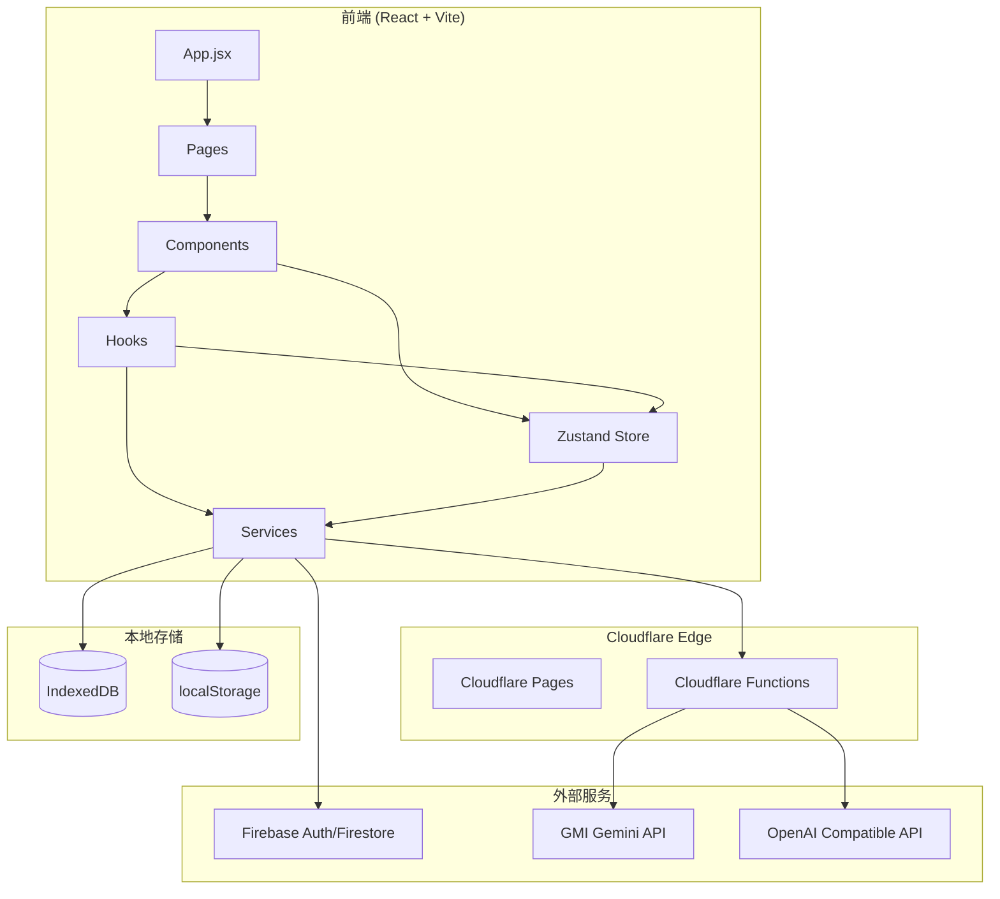
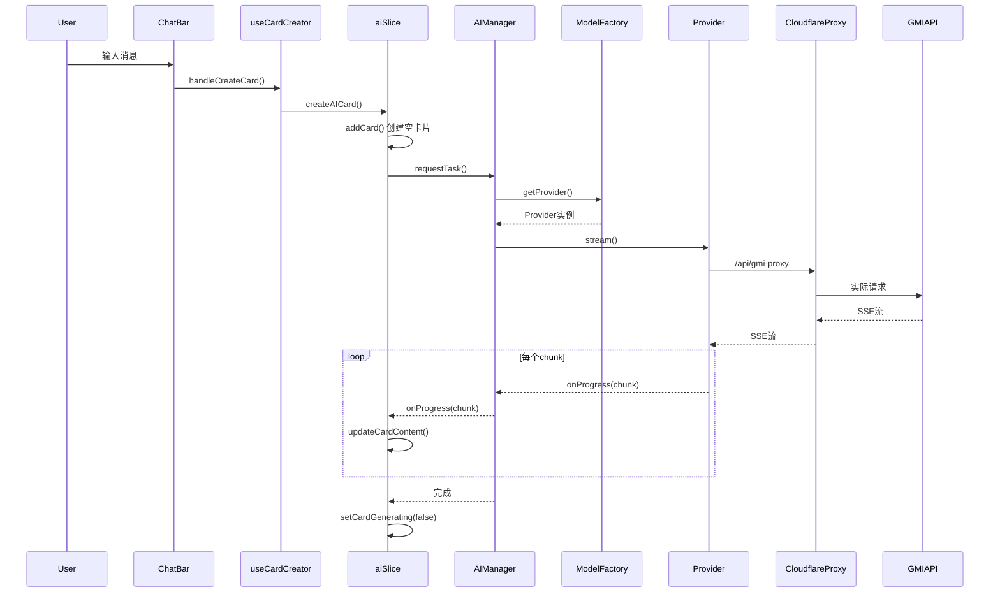
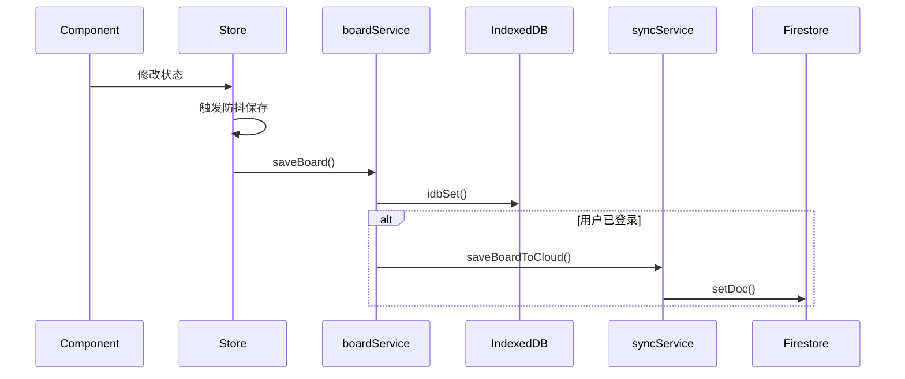
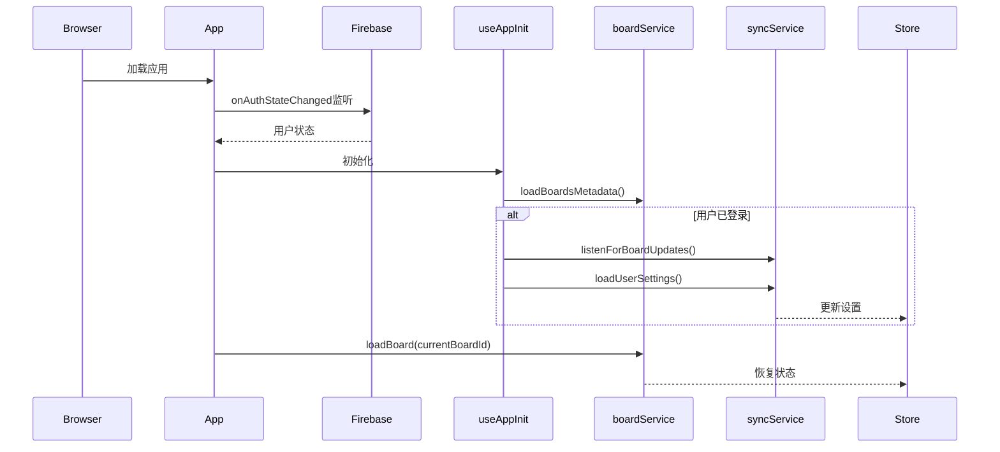

# 核心架构

## 1. 架构图

### 4.2 数据流概述

1. **用户交互** → 触发组件事件
2. **组件** → 调用 Hooks 或 Store Actions
3. **Store Actions** → 更新状态 & 调用 Services
4. **Services** → 
   - 本地：IndexedDB / localStorage
   - 远程：Firebase / Cloudflare Functions
5. **Cloudflare Functions** → 代理 AI 请求，保护 API Key

---

## 2. 详细数据流

### 2.1 用户发送消息流程

### 2.2 画板保存流程

### 2.3 应用启动流程

