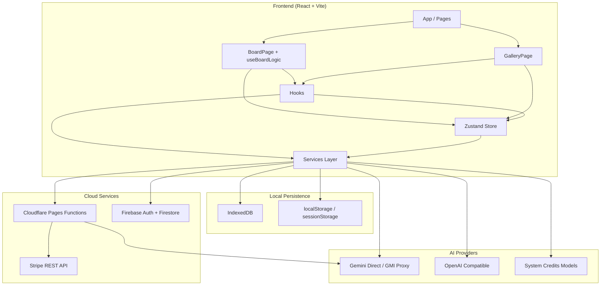
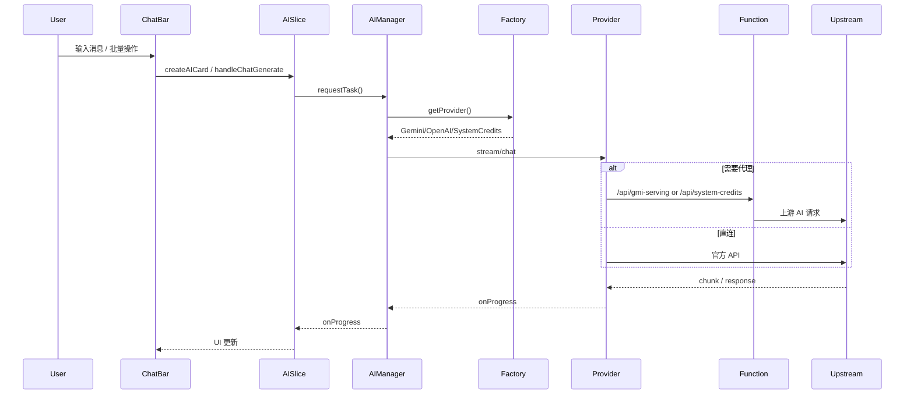
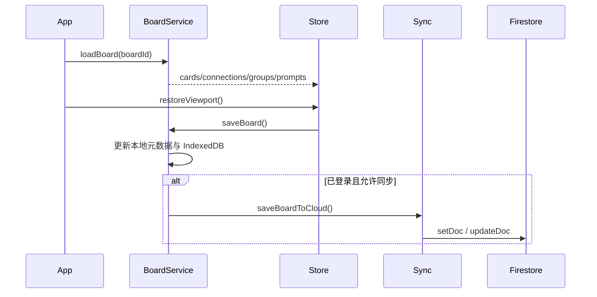

# 核心架构

## 1. 高层架构图

```mermaid
graph TB
    subgraph Frontend["Frontend (React + Vite)"]
        App["App / Pages"]
        Board["BoardPage + useBoardLogic"]
        Gallery["GalleryPage"]
        Store["Zustand Store"]
        Hooks["Hooks"]
        Services["Services Layer"]
    end

    subgraph Local["Local Persistence"]
        IDB["IndexedDB"]
        LS["localStorage / sessionStorage"]
    end

    subgraph Cloud["Cloud Services"]
        CF["Cloudflare Pages Functions"]
        Firebase["Firebase Auth + Firestore"]
        Stripe["Stripe REST API"]
    end

    subgraph AI["AI Providers"]
        Gemini["Gemini Direct / GMI Proxy"]
        OpenAI["OpenAI Compatible"]
        System["System Credits Models"]
    end

    App --> Board
    App --> Gallery
    Board --> Hooks
    Gallery --> Hooks
    Board --> Store
    Gallery --> Store
    Hooks --> Store
    Hooks --> Services
    Store --> Services

    Services --> IDB
    Services --> LS
    Services --> Firebase
    Services --> CF

    CF --> Gemini
    CF --> Stripe
    Services --> OpenAI
    Services --> Gemini
    Services --> System
```

## 2. 前端分层

### 路由层

- `App.jsx` 负责路由、登录登出、画板切换、搜索模态框和全局对话框。
- `GalleryPage.jsx` 是“产品主页”，不是单纯列表页，里面还承载笔记中心、统计、反馈、支付成功回流。
- `BoardPage.jsx` 是画板运行时外壳，负责把 `Canvas`、`ChatBar`、`BoardTopBar`、`Sidebar`、`BoardInstructionPanel`、`NotePage` 等组合起来。

### 状态层

- `src/store/useStore.js` 通过 slices 组合全局状态，并使用 Zundo 维护历史记录。
- 画布、卡片、AI、配置、积分、分享、画板 Prompt 等状态都已独立切片，不再集中堆在单个组件。

### 服务层

- `llm/` 负责 Provider 选择、协议转换、流式处理、重试、并发闸门。
- `syncService.js` 负责监听、冲突处理、写入重试、离线模式降级。
- `boardService.js` 负责本地画板数据、回收站、视口状态、搜索加载数据。

## 3. 关键数据流

### 3.1 AI 对话流

```mermaid
sequenceDiagram
    participant User
    participant ChatBar
    participant AISlice
    participant AIManager
    participant Factory
    participant Provider
    participant Function
    participant Upstream

    User->>ChatBar: 输入消息 / 批量操作
    ChatBar->>AISlice: createAICard / handleChatGenerate
    AISlice->>AIManager: requestTask()
    AIManager->>Factory: getProvider()
    Factory-->>AIManager: Gemini/OpenAI/SystemCredits
    AIManager->>Provider: stream/chat
    alt 需要代理
        Provider->>Function: /api/gmi-serving or /api/system-credits
        Function->>Upstream: 上游 AI 请求
    else 直连
        Provider->>Upstream: 官方 API
    end
    Upstream-->>Provider: chunk / response
    Provider-->>AIManager: onProgress
    AIManager-->>AISlice: onProgress
    AISlice-->>ChatBar: UI 更新
```

### 3.2 画板加载与保存

```mermaid
sequenceDiagram
    participant App
    participant BoardService
    participant Store
    participant Sync
    participant Firestore

    App->>BoardService: loadBoard(boardId)
    BoardService-->>Store: cards/connections/groups/prompts
    App->>Store: restoreViewport()

    Store->>BoardService: saveBoard()
    BoardService->>BoardService: 更新本地元数据与 IndexedDB
    alt 已登录且允许同步
        BoardService->>Sync: saveBoardToCloud()
        Sync->>Firestore: setDoc / updateDoc
    end
```

### 3.3 画廊搜索流

- 打开 `SearchModal` 后，不会一次性把所有画板完整注入内存。
- `loadBoardsSearchData()` 会按受控并发逐个加载缺失画板内容，并用缓冲区批量刷新 UI。
- 这条链路是近期性能优化重点之一。

## 4. 当前架构里最重要的稳定性策略

- AI 请求存在“两层并发控制”：`AIManager` 的卡片级调度 + Gemini provider/model 级并发闸门。
- Firestore 同步存在“两层保护”：写入重试/排队 + 自动离线模式降级。
- 画板切换存在“加载期空状态保护”：避免加载中的空数组覆盖真实数据。
- 多标签页编辑存在“主标签锁”：非主标签页进入只读，并允许手动接管。
