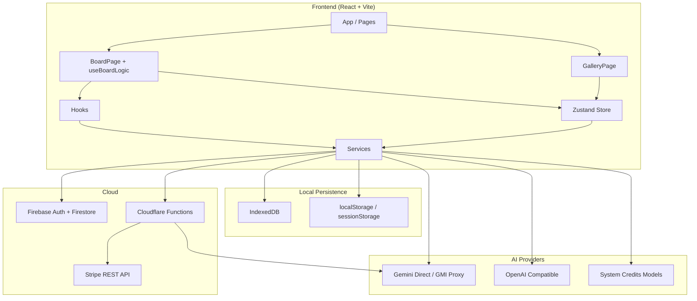
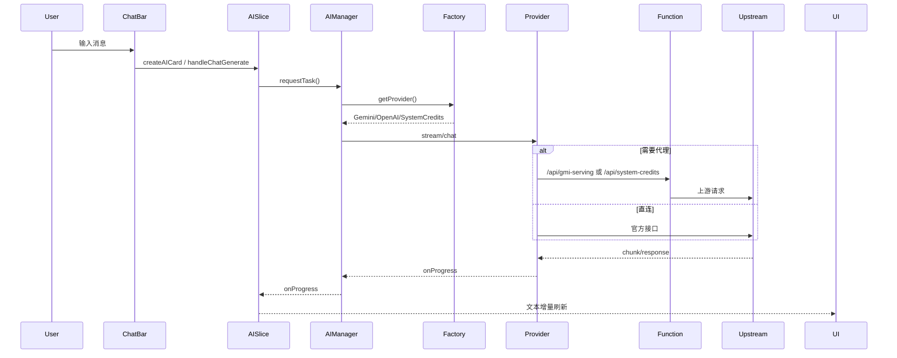
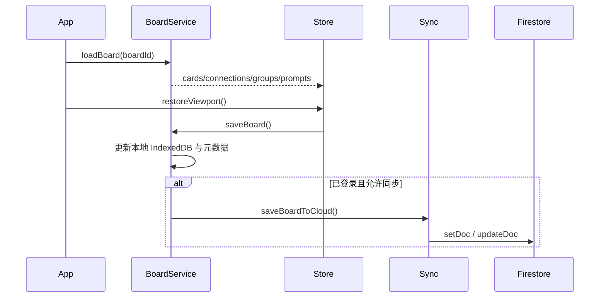

# NexMap 代码库总文档

当前文档快照：`v2.2.190`，同步日期 `2026-03-13`

这份文件现在承担原来多份文档的内容，目标是减少 Markdown 文件数量，同时保留足够细的上下文，方便未来人和 AI 一次读懂项目现状。

## 目录

1. 项目快照
2. 目录结构与路由入口
3. 运行时架构
4. 状态管理
5. 服务层
6. UI 模块与 Hooks
7. 关键业务规则
8. 部署与运行
9. 常见问题与维护注意事项

## 1. 项目快照

### 1.1 当前项目是什么

NexMap 是一个 AI 驱动的无限画布工作区，不是单纯的聊天工具。它把对话、卡片、便签、连线、图片、画板 Prompt、自定义指令和画板元数据放进同一块空间里协作。

当前实现已经包含：

- 画板创作：卡片、便签、连线、分组、框选、拖拽、平移缩放、自动布局
- AI 协作：流式回答、批量对话、Sprout/分叉、图片生成、收藏消息
- 画板增强：自动命名、自动摘要、自动背景图、画板级 Prompt、自定义指令面板
- 画廊能力：搜索、收藏夹、笔记中心、统计、回收站、反馈、定价页
- 配置能力：多 Provider、角色模型、系统额度、对象存储、FlowStudio 联动
- 云端能力：Firebase 登录与同步、Cloudflare Functions、Stripe 支付
- 附加模块：浏览器扩展、SEO middleware

### 1.2 技术栈

| 类别 | 当前技术 |
| --- | --- |
| 前端框架 | React 18 + Vite |
| 路由 | React Router DOM v7 |
| 状态管理 | Zustand slices + Zundo temporal |
| 样式与动效 | Tailwind CSS + Framer Motion |
| 本地存储 | IndexedDB、localStorage、sessionStorage |
| 云服务 | Firebase Auth / Firestore |
| AI 协议 | Gemini Native、OpenAI Compatible、系统额度代理 |
| 部署 | Cloudflare Pages + Cloudflare Functions |
| 支付 | Stripe REST API（通过 Functions 调用） |

## 2. 目录结构与路由入口

### 2.1 主要目录

```text
/Users/kang/Documents/aimainmap
├── src/
│   ├── App.jsx
│   ├── main.jsx
│   ├── components/
│   │   ├── board/
│   │   ├── chat/
│   │   ├── feedback/
│   │   ├── notes/
│   │   ├── settings/
│   │   └── share/
│   ├── hooks/
│   ├── pages/
│   ├── services/
│   │   ├── ai/
│   │   ├── boardTitle/
│   │   ├── db/
│   │   ├── image/
│   │   ├── llm/
│   │   ├── search/
│   │   ├── stats/
│   │   └── systemCredits/
│   ├── store/
│   │   └── slices/
│   ├── modules/landing/
│   └── utils/
├── functions/
│   ├── _middleware.js
│   └── api/
├── browser-extension/
├── docs/
└── public/
```

### 2.2 主要路由

| 路由 | 作用 |
| --- | --- |
| `/`、`/intro` | 官网落地页 |
| `/gallery/*` | 画廊首页、收藏、笔记、统计、回收站、反馈 |
| `/board/:id` | 主画板页 |
| `/board/:id/note/:noteId` | 画板内便签全屏视图 |
| `/pricing` | 套餐与支付 |
| `/feedback` | 公开反馈页 |
| `/admin` | 隐藏管理页 |

### 2.3 当前入口职责

- `src/App.jsx`
  - 路由装配
  - 登录/登出
  - 画板切换与加载
  - 全局搜索模态框
  - 全局对话框
- `src/pages/GalleryPage.jsx`
  - 画板列表
  - 笔记中心、统计、反馈入口
  - 设置入口
  - 支付成功回流
- `src/pages/BoardPage.jsx`
  - 画板运行时壳层
  - 组合 Canvas、ChatBar、Sidebar、BoardTopBar、BoardInstructionPanel、NotePage

## 3. 运行时架构

### 3.1 高层图



### 3.2 关键数据流

#### AI 对话流



#### 画板加载与保存



#### 搜索加载

- `SearchModal` 打开后不会一次性把所有画板内容全部塞进内存。
- `loadBoardsSearchData()` 按受控并发逐个加载缺失画板内容。
- 结果会先进入缓冲区，再批量刷新 UI，降低大画廊的卡顿。

### 3.3 当前最重要的稳定性策略

- AI 并发是两层控制：`AIManager` 的卡片级调度 + Gemini provider 的模型级并发闸门
- Firestore 同步有重试、队列、游标和自动离线模式
- 画板切换时有加载期空状态保护，避免 transient 空数组覆盖真实数据
- 多标签页编辑有只读锁和接管机制

## 4. 状态管理

### 4.1 Store 根入口

根入口是 `src/store/useStore.js`。

当前特征：

- 使用 Zustand 组合 10 个 slices
- 使用 Zundo temporal middleware 维护撤销/重做
- 历史记录上限为 50 步
- 历史只追踪 `cards`、`connections`、`groups`、`boardPrompts`
- 暴露 `undo`、`redo`、`clearHistory`

### 4.2 Slice 清单

| Slice | 主要职责 |
| --- | --- |
| `canvasSlice` | 画布偏移、缩放、交互模式、连接起点、加载状态 |
| `cardSlice` | 卡片 CRUD、移动、正文更新、删除 |
| `connectionSlice` | 连线创建、删除、关联查询 |
| `groupSlice` | 分组/Zone 管理 |
| `selectionSlice` | 选中集与框选 |
| `aiSlice` | 生成中卡片、消息排队、流式更新、收藏、AI 入口动作 |
| `settingsSlice` | Provider 配置、角色模型、快速模型切换、离线模式 |
| `shareSlice` | 分享相关状态 |
| `creditsSlice` | 系统额度、Pro 状态、加载状态 |
| `boardSlice` | 画板 Prompt、全局 Prompt、画板指令设置 |

### 4.3 关键状态模式

#### `aiSlice`

- `generatingCardIds`: 正在生成的卡片集合
- `pendingMessages`: 卡片级待发送消息队列
- `createAICard()`: 建卡并初始化对话
- `handleChatGenerate()`: 组装上下文后进入 AIManager
- `toggleFavorite()`: 收藏消息

这层让“流式回复期间继续发消息”“关闭 ChatModal 后仍排队发送”成为正式能力。

#### `settingsSlice`

- `providers` / `globalRoles` 是长期配置
- `quickChatModel` / `quickChatProviderId` 是画布级临时覆盖
- `getEffectiveChatConfig()` 先看会话覆盖，再看全局角色配置
- `offlineMode` 既可能手动开启，也可能由同步异常自动触发

#### `boardSlice`

当前不只是 `boardPrompts`，还管理：

- `boardInstructionSettings`
- `globalPrompts`
- Prompt 持久化与更新时间

### 4.4 使用 Store 的注意事项

- selector 尽量只返回稳定原始字段，不要在 selector 内构造新对象
- 最近修复过 `getEffectiveChatConfig()` 直接用于 selector 导致 React 无限重渲染的问题
- 高频流式更新已经通过 `streamRenderBuffer` 缓冲，不要在组件层再叠粗暴 `setState`

## 5. 服务层

### 5.1 服务层总览

`src/services/` 已经是主要业务中台，而不是简单的 API 包装目录。

| 模块 | 作用 |
| --- | --- |
| `llm.js` | AI 文本/流式/图片统一入口 |
| `llm/` | Provider 工厂、注册表、协议实现、解析器、并发闸门、KeyPool |
| `ai/AIManager.js` | AI 任务调度中心 |
| `boardService.js` | 本地画板 CRUD、回收站、视口、搜索加载 |
| `storage.js` | 对旧调用保持兼容的 facade |
| `syncService.js` | Firestore 同步、监听、重试、离线模式 |
| `customInstructionsService.js` | 自定义指令目录与画板启用规则 |
| `boardTitle/metadata.js` | 自动/手动/占位标题规则 |
| `search/searchDataLoader.js` | 搜索数据并发加载器 |
| `favoritesService.js` | 收藏能力 |
| `notesService.js` | 笔记中心数据 |
| `s3.js` | 可选对象存储上传 |
| `linkageService.js` | FlowStudio 联动 |

### 5.2 LLM 体系

#### 统一入口

`src/services/llm.js` 负责：

- 文本补全
- 流式对话
- 图片生成
- 其他分析类调用

#### Provider 选择

`src/services/llm/factory.js` 当前规则：

- 没有用户 API Key 时默认走 `SystemCreditsProvider`
- `protocol === gemini` 且模型名确实是 Gemini/Gemma 时走 `GeminiProvider`
- 其他情况走 `OpenAIProvider`

#### Gemini 链路

`src/services/llm/providers/gemini.js` 是最复杂的服务之一，承担：

- 官方 Gemini 直连与 GMI 代理的链路区分
- KeyPool 冷却与等待
- 模型级/请求级重试
- `gemini-3.1-pro-preview` 的特殊 fallback 与高负载处理
- 搜索工具默认策略
- 流式解析与非流式降级协作
- 图片生成入口

配套文件：

- `providers/gemini/errorUtils.js`
- `providers/gemini/streamParser.js`
- `providers/gemini/concurrencyGate.js`
- `providers/gemini/partUtils.js`

### 5.3 AI 调度中心

`src/services/ai/AIManager.js` 当前承担：

- 按优先级排队
- 卡片级并发上限（当前 `8`）
- 重复任务去重（非 chat 类型）
- 按 `card:{id}` 标签取消任务
- 任务完成/失败/取消后自动继续 drain 队列

### 5.4 本地存储与同步

#### `boardService.js`

负责：

- 画板元数据列表
- 画板正文保存/加载
- 软删除、恢复、永久删除
- 视口状态
- 搜索模块所需的板内容加载

#### `storage.js`

它是兼容层，不是新的业务中心。旧代码仍通过这里调用：

- `createBoard`
- `saveBoard`
- `loadBoard`
- `saveBoardToCloud`
- `updateUserSettings`

真实实现已拆到 `boardService.js` / `syncService.js` / `imageStore.js`。

#### `syncService.js`

现在包含：

- 画板元数据监听
- 当前活跃画板监听
- 云端写入排队
- 重试定时器
- 快照游标
- 离线模式自动切换
- 配额 / 网络问题检测
- 同步成功后的离线状态恢复

### 5.5 指令、自动命名与自动摘要

#### 自定义指令

`customInstructionsService.js` 提供：

- 指令条目标准化
- 全局/可选指令拆分
- 画板已启用指令集合清洗
- 当前画板有效指令解析
- 本地缓存读写

#### 自动命名

`useAutoBoardNaming.js` 联合：

- `boardTitle/metadata.js`
- `services/ai/boardAutoTitleService.js`

来判断：

- 当前标题是不是占位标题
- 是否已被用户手动命名
- 是否达到自动命名阈值

#### 自动摘要与背景

`useAutoBoardSummaries.js` / `useBoardBackground.js` 当前负责：

- `3-9` 张卡时尝试生成摘要
- `10+` 张卡时尝试生成背景图
- 尽量避免会话内重复触发

## 6. UI 模块与 Hooks

### 6.1 页面与核心组件

| 组件 | 作用 |
| --- | --- |
| `App.jsx` | 路由、登录登出、画板加载、搜索模态框、全局对话框 |
| `GalleryPage.jsx` | 画板首页、收藏、笔记、统计、回收站、反馈入口 |
| `BoardPage.jsx` | 画板运行时壳层 |
| `Canvas.jsx` | 画布渲染与交互层 |
| `BoardTopBar.jsx` | 标题、返回、指令面板入口 |
| `Sidebar.jsx` | 侧边工具入口 |
| `BoardInstructionPanel.jsx` | 指令启用与推荐状态 |
| `ChatBar.jsx` | 主输入条、批量操作、图片上传、Sprout 触发 |
| `ChatModal.jsx` | 卡片展开对话 |
| `NotePage.jsx` | 便签全屏视图 |
| `SettingsModal.jsx` | 配置中心，已拆成多 tab |

### 6.2 画廊周边组件

- `BoardGallery.jsx`: 瀑布流、最近访问、回收站布局
- `BoardCard.jsx`: 画板卡片、封面、摘要、背景、删除/恢复入口
- `FavoritesGallery.jsx`: 收藏列表
- `NotesCenter.jsx`: 笔记中心
- `StatisticsView.jsx` / `UsageStatsModal.jsx`: 数据展示
- `PaymentModal.jsx` / `PaymentSuccessModal.jsx`: 支付链路 UI

### 6.3 Hooks 总览

| Hook | 作用 |
| --- | --- |
| `useAppInit` | 登录态初始化、画板列表、基础数据启动 |
| `useBoardLogic` | 画板主编排 Hook |
| `useBoardSync` | 当前画板云同步监听 |
| `useTabLock` | 多标签页只读锁与接管 |
| `useBoardBackground` | 画板摘要/背景生成 |
| `useAutoBoardNaming` | 自动命名队列 |
| `useAutoBoardSummaries` | 自动摘要/背景触发 |
| `useCardCreator` | 建卡、建便签、批量 AI 创建 |
| `useAISprouting` | Sprout / 分叉工作流 |
| `useSelection` | 框选逻辑 |
| `useCanvasGestures` | 平移、滚轮缩放、触控手势 |
| `useGlobalHotkeys` | 全局快捷键 |
| `useImageUpload` | 图片上传 |
| `useThumbnailCapture` | 缩略图捕获 |
| `useVisibleCanvasData` | 画布可视区域数据选择 |

### 6.4 最关键的 Hooks

#### `useBoardLogic`

这是当前画板页最重要的编排层，负责把以下内容串起来：

- store 中的卡片、连接、分组、设置、指令、AI 状态
- 画板内创建/删除/批量对话/分叉/便签创建
- 路由、全屏便签、拖拽粘贴、Prompt Drop
- 指令面板与设置联动

#### `useBoardSync`

负责：

- 监听当前活跃画板的云端变化
- 避免多标签页编辑冲突
- 将实时更新写回本地状态

## 7. 关键业务规则

### 7.1 Provider 与模型选择

- 用户没有 API Key 时，文本类能力默认退回系统额度链路
- `protocol = gemini` 且模型名确实是 Gemini/Gemma，走 Gemini 原生协议
- 其他模型即便挂在同一个 provider 下，也可能自动按 OpenAI Compatible 发送
- `quickChatModel` 只临时覆盖对话角色，不直接改全局配置

### 7.2 官方 Gemini 直连与代理不是同一套规则

当前代码明确区分：

- 官方直连：`generativelanguage.googleapis.com + AIza Key`
- 代理/GMI：`api.gmi-serving.com` 或 bearer token 链

这会影响：

- 搜索工具默认是否开启
- 失败时是否允许 fallback
- 重试次数
- 是否优先直连还是优先代理

### 7.3 AI 并发与消息排队

当前 AI 并发至少有四层规则：

1. `AIManager` 的全局任务队列
2. 卡片级互斥
3. Gemini provider 的并发闸门
4. KeyPool / 冷却等待 / 重试节流

另外 `aiSlice.pendingMessages` 允许用户在当前流式回答未结束时继续发消息，系统会在前一条完成后自动串行处理。

### 7.4 云同步与数据安全

当前同步链不是“本地改一下就直接 Firestore setDoc”：

- 本地保存和云保存是两条链路
- 监听元数据与监听单画板正文分离
- 会检查版本号、更新时间和加载阶段
- 网络/配额异常会把应用切到离线模式
- 离线模式恢复后再尝试继续同步

### 7.5 标题、摘要、背景图规则

- 占位标题、自动标题、手动标题被明确区分
- 用户手动输入后，后续自动命名不应覆盖
- `3-9` 张卡优先生成文字摘要
- `10+` 张卡优先生成背景图

### 7.6 自定义指令

当前自定义指令分两类：

- 全局指令：始终生效
- 可选指令：按画板启用或自动推荐结果启用

### 7.7 回收站与系统额度

- 删除画板默认是软删除
- 回收站中可恢复
- 永久删除才真正移除数据
- 系统额度当前包含每周免费对话额度、每周免费图片额度、Stripe 增购 credits、兑换码补充和 Pro 开通

## 8. 部署与运行

### 8.1 本地开发

```bash
npm install
npm run dev
```

本地构建：

```bash
npm run build
```

`npm run build` 会执行：

1. `node scripts/generate-sitemap.js`
2. `npx vite build`

### 8.2 Cloudflare Pages 脚本

```bash
npm run deploy:main
npm run deploy:beta
npm run deploy:alpha

npm run ship:main
npm run ship:beta
npm run ship:alpha
```

说明：

- `deploy:*`：构建并部署到 Cloudflare Pages 指定分支
- `ship:*`：部署后再执行 `git push origin <branch>`
- 默认脚本当前仍指向 beta

### 8.3 浏览器扩展打包

```bash
npm run ext:build
npm run ext:zip
```

### 8.4 Functions 环境变量 / Binding

| 名称 | 用途 |
| --- | --- |
| `SYSTEM_GMI_API_KEY` | 系统额度与免费图片生成上游 Key |
| `SYSTEM_CREDITS_KV` | 免费额度与兑换码 KV |
| `STRIPE_SECRET_KEY` | Stripe Session/Order 查询 |
| `STRIPE_WEBHOOK_SECRET` | Stripe Webhook |
| `ADMIN_UIDS` | 管理员 UID 白名单 |
| `VITE_S3_CONFIG_JSON` | 可选的前端默认对象存储配置 |

### 8.5 当前部署层面的事实

- 前端 Firebase 配置当前直接写在 `src/services/firebase.js`
- 没有独立 `wrangler.toml` 参与脚本分支切换
- `functions/_middleware.js` 会在 bot 访问时做 SEO meta 注入

## 9. 常见问题与维护注意事项

### 9.1 数据都存在哪里

| 数据 | 位置 | 说明 |
| --- | --- | --- |
| 画板正文 | IndexedDB + Firestore | 本地优先，登录后同步 |
| 画板列表元数据 | localStorage + Firestore | 包括标题、摘要、背景、删除状态 |
| 视口状态 | localStorage | 每个画板单独记录 |
| Provider 配置 | localStorage (`mixboard_providers_v3`) | 模型和协议配置 |
| 快速模型切换 | localStorage (`mixboard_quick_models`) | 只影响对话角色 |
| 全局 Prompt | localStorage | 由 `boardSlice` 管理 |
| 自定义指令 | localStorage + 云端设置 | 画板启用状态另有缓存 |
| 图片 | IndexedDB / 对象存储 / base64 回退 | 视配置而定 |
| 系统额度 / 兑换码 | Cloudflare KV | 服务端管理 |

### 9.2 常见现象解释

- 自动进入离线模式：通常是 Firestore 配额或网络异常的保护机制
- 两个标签页有一个只读：`useTabLock` 在避免多标签页同时写同一画板
- 同样叫 Gemini 却走不同链路：要看 `baseUrl`、Key 类型和 provider 配置
- 没配 API Key 也能用：因为系统额度会兜底

### 9.3 维护建议

- 新增状态逻辑优先落在 slice 或 hook，不要重新堆回组件
- 处理 Gemini 问题时必须同时考虑代理、直连、KeyPool、重试、搜索工具四个维度
- 修改同步层时优先确认加载期空状态保护是否仍然有效
