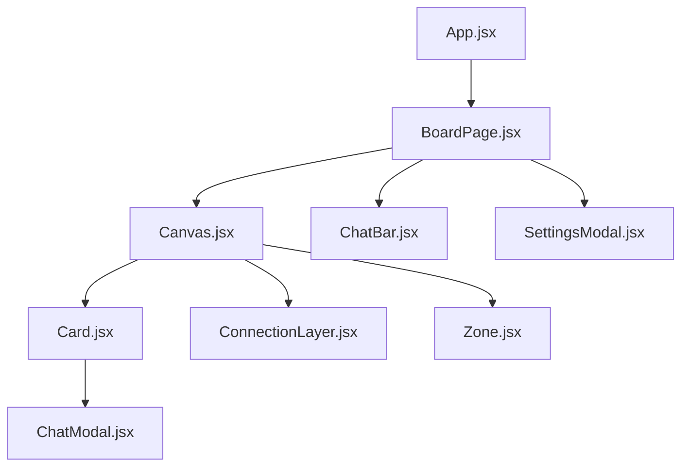

# 组件系统 (Components)

## 1. 核心组件关系



### 1.1 `App.jsx` - 应用入口

**职责：**
- Firebase Auth 状态监听
- 路由配置
- 全局 Dialog 管理
- 画板 CRUD 逻辑

**关键状态：**
```javascript
const [user, setUser] = useState(null);           // 当前用户
const [boardsList, setBoardsList] = useState([]); // 画板列表
```

**路由结构：**
```javascript
<Routes>
    <Route path="/" element={<HomePage />} />
    <Route path="/board/:boardId" element={<BoardPage />} />
</Routes>
```

### 1.2 `BoardPage.jsx` - 主画板页

**职责：**
- 加载/保存画板数据
- 处理用户输入
- 协调各组件交互
- 自动保存 (防抖)

**关键 Hooks 使用：**
```javascript
const { handleCreateCard, handleBatchChat, createCardWithText } = useCardCreator();
const { handleExpandTopics, handleSprout } = useAISprouting();
const { setInteractionMode, selectedIds, ... } = useStore();
```

### 1.3 `Canvas.jsx` - 无限画布

**职责：**
- 渲染所有卡片/便签/Zone
- 处理画布手势 (拖拽/缩放)
- 框选逻辑
- 双击创建

**关键逻辑：**
```javascript
// 坐标转换
const toCanvasCoords = (viewX, viewY) => ({
    x: (viewX - offset.x) / scale,
    y: (viewY - offset.y) / scale
});

// 渲染位置
const transform = `translate(${offset.x}px, ${offset.y}px) scale(${scale})`;
```

### 1.4 `Card.jsx` - 对话卡片

**职责：**
- 显示卡片预览
- 拖拽交互
- 点击展开 ChatModal
- 连接按钮

**拖拽使用：**
```javascript
const { style, handleMouseDown, handleTouchStart } = useDraggable({
    id: data.id,
    x: data.x,
    y: data.y,
    isSelected,
    onSelect,
    onMove,
    onDragEnd
});
```

### 1.5 `ChatBar.jsx` - 底部输入栏

**职责：**
- 文本输入
- 图片上传
- 提交到 AI
- 批量操作按钮

**动作按钮：**
- 📷 上传图片
- 📝 创建便签
- 🌳 扩展话题 (选中时)
- 🔗 选择连接的卡片 (选中时)
- 📐 网格布局 (选中时)
- ✨ 提交 (AI 生成)

### 1.6 `ConnectionLayer.jsx` - 连线渲染

**职责：**
- 渲染卡片间连线 (SVG)
- 连线悬停删除

**实现：**
```javascript
// 使用 SVG 绘制贝塞尔曲线
<svg>
    {connections.map(conn => {
        const fromCard = cards.find(c => c.id === conn.from);
        const toCard = cards.find(c => c.id === conn.to);
        // 计算路径...
        return <path d={...} />;
    })}
</svg>
```
