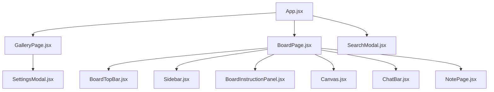

# 组件系统

## 1. 当前 UI 结构

项目 UI 已经从早期的“几个大组件”演进成分区明显的组件树：

```mermaid
graph TB
    App["App.jsx"]
    Gallery["GalleryPage.jsx"]
    Board["BoardPage.jsx"]
    Settings["SettingsModal.jsx"]
    Search["SearchModal.jsx"]
    Canvas["Canvas.jsx"]
    TopBar["BoardTopBar.jsx"]
    Sidebar["Sidebar.jsx"]
    Instruction["BoardInstructionPanel.jsx"]
    ChatBar["ChatBar.jsx"]
    Note["NotePage.jsx"]

    App --> Gallery
    App --> Board
    App --> Search
    Board --> TopBar
    Board --> Sidebar
    Board --> Instruction
    Board --> Canvas
    Board --> ChatBar
    Board --> Note
    Gallery --> Settings
```

## 2. 主要页面级组件

| 组件 | 作用 |
| --- | --- |
| `App.jsx` | 路由、登录登出、画板切换、搜索模态框、全局对话框 |
| `GalleryPage.jsx` | 画廊首页、收藏、笔记、统计、回收站、反馈入口 |
| `BoardPage.jsx` | 画板运行壳层 |
| `PricingPage.jsx` | 定价与支付入口 |
| `FeedbackPage.jsx` | 反馈列表、投票、评论 |
| `AdminPage.jsx` | 隐藏管理页 |

## 3. 画板相关核心组件

| 组件 | 当前职责 |
| --- | --- |
| `Canvas.jsx` | 画布渲染、卡片/分组/连线可见层协同、拖拽与双击入口 |
| `BoardTopBar.jsx` | 画板标题、返回、指令面板入口 |
| `Sidebar.jsx` | 画布侧边工具入口 |
| `BoardInstructionPanel.jsx` | 自定义指令启用、自动推荐状态、跳转设置 |
| `ChatBar.jsx` | 主输入条、批量动作、图片上传、Sprout 触发 |
| `ChatModal.jsx` | 卡片展开对话窗口 |
| `NotePage.jsx` | 便签全屏编辑视图 |
| `StatusBar.jsx` | 同步/状态提示 |

## 4. 画廊与周边组件

- `BoardGallery.jsx`: 画板卡片瀑布流、最近访问、回收站布局
- `BoardCard.jsx`: 单个画板卡片，包含封面、摘要、背景图、删除/恢复入口
- `FavoritesGallery.jsx`: 收藏内容列表
- `NotesCenter.jsx`: 笔记中心
- `StatisticsView.jsx` / `UsageStatsModal.jsx`: 使用数据展示
- `FeedbackView.jsx` 与 `feedback/*`: 反馈系统 UI
- `PaymentModal.jsx` / `PaymentSuccessModal.jsx`: 支付链路 UI

## 5. 设置与分享

- `SettingsModal.jsx` 已拆成多 tab：
  - `SettingsCreditsTab`
  - `SettingsLLMTab`
  - `SettingsRolesTab`
  - `SettingsStorageTab`
  - `SettingsGeneralTab`
  - `SettingsInstructionsTab`
  - `SettingsLinkageTab`
- `share/*` 目录负责可分享内容预览、控制项、主题配置

## 6. 组件层的边界建议

- 复杂业务规则尽量留在 hooks 和 services，不要在组件里新增大段协议或同步逻辑。
- 如果一个组件开始同时处理“路由 + 存储 + AI + 动画 + 选择逻辑”，应优先拆出 hook 或 service，而不是继续堆进 JSX 文件。
