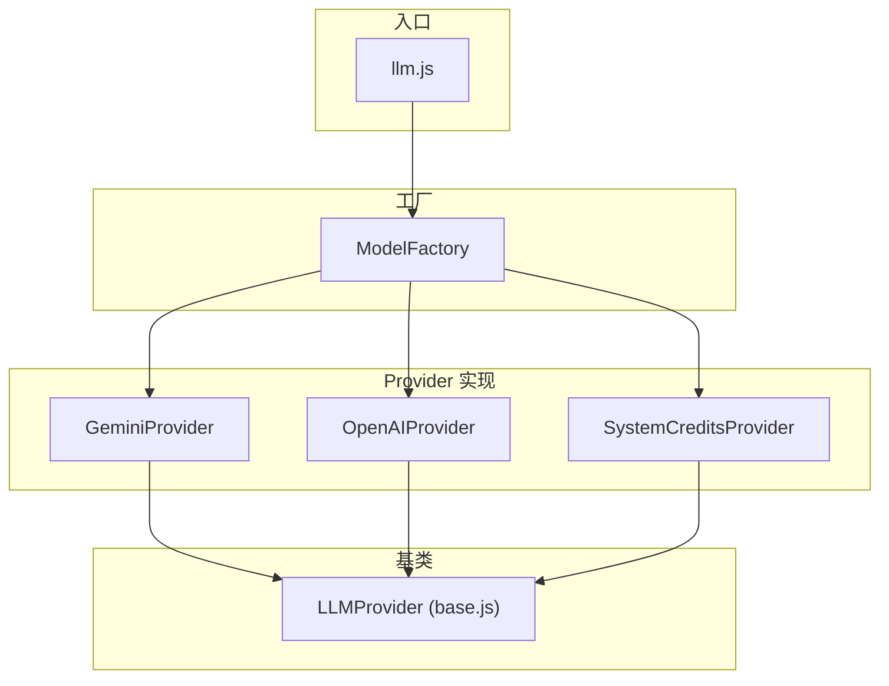

# 服务层 (Services)

## 1. LLM 服务架构



### 1.1 `llm.js` - 统一入口

```javascript
// 主要导出函数：

// 1. 聊天补全 (非流式)
export async function chatCompletion(messages, config, model = null, options = {})

// 2. 流式聊天 (主对话用)
export async function streamChatCompletion(messages, config, onToken, model = null, options = {})

// 3. 图片生成
export async function imageGeneration(prompt, config, model = null, options = {})

// 4. 生成后续话题 (分析角色)
export async function generateFollowUpTopics(messages, config, model = null, options = {})
```

### 1.2 `factory.js` - Provider 工厂

```javascript
export class ModelFactory {
    static getProvider(config, options = {}) {
        // 1. 无 API Key → SystemCreditsProvider (免费试用)
        if (!hasApiKey && !options.skipSystemCredits) {
            return new SystemCreditsProvider();
        }
        
        // 2. 根据协议选择 Provider
        switch (config.protocol) {
            case 'gemini': return new GeminiProvider(config);
            case 'openai': return new OpenAIProvider(config);
            default: return new OpenAIProvider(config);
        }
    }
    
    static shouldUseSystemCredits(config) {
        return !config?.apiKey || config.apiKey.trim() === '';
    }
}
```

### 1.3 `providers/gemini.js` - Gemini 原生协议

**特点：**
- 支持 Gemini 原生 API 格式
- 支持多模态 (文本 + 图片)
- 支持 Google Search 工具
- 支持流式响应
- 图片生成使用专门的模型

**关键方法：**
```javascript
class GeminiProvider extends LLMProvider {
    // 消息格式转换 (OpenAI → Gemini)
    formatMessages(messages) { /* ... */ }
    
    // 非流式聊天
    async chat(messages, model, options = {}) { /* ... */ }
    
    // 流式聊天
    async stream(messages, onToken, model, options = {}) {
        // 1. 构造 tools (Google Search)
        // 2. 通过 Cloudflare Proxy 请求
        // 3. 解析 SSE 流
        // 4. 处理 functionCall 和 text 响应
    }
    
    // 图片生成 (GMI Cloud)
    async generateImage(prompt, model, options = {}) { /* ... */ }
}
```

### 1.4 `providers/openai.js` - OpenAI Compatible

**特点：**
- 兼容所有 OpenAI 格式 API
- 支持自定义 baseUrl
- 支持 DALL-E 和 Gemini 风格图片生成

### 1.5 `providers/systemCredits.js` - 免费额度

**特点：**
- 无需用户 API Key
- 通过 Cloudflare Function 代理
- 自动计算 Token 消耗
- 扣除用户额度

## 2. `AIManager.js` - 任务队列

```javascript
// 优先级定义
export const PRIORITY = {
    CRITICAL: 3,  // 用户直接等待 (如 Modal Chat)
    HIGH: 2,      // 可见 UI 更新 (如卡片生成)
    LOW: 1        // 后台任务
};

// 任务状态
export const STATUS = {
    PENDING: 'pending',
    RUNNING: 'running',
    COMPLETED: 'completed',
    FAILED: 'failed',
    CANCELLED: 'cancelled'
};

class AIManager {
    constructor() {
        this.queue = [];           // 待执行任务队列
        this.activeTasks = new Map(); // 正在执行的任务
        this.maxConcurrent = 3;    // 最大并发数
    }
    
    // 提交任务
    async requestTask({ type, priority, payload, tags, onProgress }) {
        // 1. 取消队列中冲突的任务 (按 tags 匹配)
        // 2. 创建任务对象
        // 3. 加入队列并排序
        // 4. 触发队列处理
        // 5. 返回 Promise
    }
    
    // 队列处理
    _processQueue() {
        // 按优先级排序取任务
        // 并发控制
    }
    
    // 执行任务
    async _executeTask(task, signal) {
        // 根据 type 调用对应的 LLM 方法
        // type: 'chat' | 'image'
    }
}

// 单例导出
export const aiManager = new AIManager();
```

## 3. `boardService.js` - 画板服务

```javascript
// 存储 Key 常量
const BOARD_PREFIX = 'mixboard_board_';
const BOARDS_LIST_KEY = 'mixboard_boards_list';
const CURRENT_BOARD_ID_KEY = 'mixboard_current_board_id';

// 主要函数

// 画板元数据管理
export function getCurrentBoardId() { /* localStorage */ }
export function setCurrentBoardId(id) { /* localStorage */ }
export async function getBoardsList() { /* 过滤已删除 */ }
export async function getTrashBoards() { /* 回收站 */ }
export async function loadBoardsMetadata() { /* IndexedDB */ }

// CRUD
export async function createBoard(name) {
    // 1. 生成 ID
    // 2. 创建元数据 { id, name, createdAt, updatedAt }
    // 3. 存入 IndexedDB
    // 4. 更新画板列表
}

export async function saveBoard(id, data) {
    // 1. 存入 IndexedDB (带时间戳)
    // 2. 更新列表元数据
}

export async function loadBoard(id) {
    // 1. 从 IndexedDB 加载
    // 2. 处理旧格式数据迁移
    // 3. 处理图片 base64 恢复
    // 4. 返回 { cards, connections, groups, background }
}

// 软删除/恢复/永久删除
export async function deleteBoard(id) { /* 标记 deletedAt */ }
export async function restoreBoard(id) { /* 清除 deletedAt */ }
export async function permanentlyDeleteBoard(id) { /* 彻底删除 */ }

// 视口状态
export function saveViewportState(boardId, viewport) { /* localStorage */ }
export function loadViewportState(boardId) { /* localStorage */ }
```

## 4. `syncService.js` - 云同步

```javascript
// --- 实时监听 ---
export function listenForBoardUpdates(userId, onUpdate) {
    // 1. 监听 Firestore 用户画板集合
    // 2. 对比 IndexedDB 本地数据
    // 3. 自动同步到本地
    // 4. 处理冲突 (以较新的为准)
    // 返回 unsubscribe 函数
}

// --- 上传 ---
export async function saveBoardToCloud(userId, boardId, boardContent) {
    // 1. 清理 undefined 值
    // 2. 处理图片 (上传到云存储或跳过)
    // 3. 写入 Firestore
}

export async function updateBoardMetadataInCloud(userId, boardId, metadata) { /* ... */ }
export async function deleteBoardFromCloud(userId, boardId) { /* ... */ }

// --- 用户设置同步 ---
export async function saveUserSettings(userId, settings) {
    // 保存到 Firestore users/{userId}/settings/main
}

export async function loadUserSettings(userId) {
    // 从 Firestore 加载设置
}
```

## 5. `db/indexedDB.js` - 本地数据库

```javascript
const IDB_NAME = 'MixBoardDB';
const IDB_STORE = 'boards';

// 基础操作
export async function idbGet(key) { /* ... */ }
export async function idbSet(key, value) { /* ... */ }
export async function idbDel(key) { /* ... */ }
export async function idbClear() { /* 清空所有数据 (登出用) */ }
```

## 6. `clearAllUserData.js` - 登出清理

```javascript
export async function clearAllUserData() {
    console.log('[Cleanup] Starting comprehensive data cleanup...');
    
    // 1. 清除 localStorage (保留部分 UI 状态)
    const keysToKeep = ['gemini_system_prompt']; // 示例
    // ...
    
    // 2. 清除 IndexedDB
    await idbClear();
    
    // 3. 重置 Redux Store
    useStoreBase.getState().resetAllState();
    
    // 4. 清除历史记录
    clearHistory();
    
    console.log('[Cleanup] All user data cleared');
}
```
    console.log('[Cleanup] All user data cleared');
}
```

### 6.3 LLM Provider 健壮性设计 (`GeminiProvider`)
- **指数退避重试**: 实现了 `Delay * 1.5` (Stream) 和 `Delay * 2` (Chat) 的指数退避策略。
- **特殊错误处理**:
    - **404 Proxy Error**: 明确提示部署问题。
    - **Image Validation**: 自动过滤没有 `data` 的 image parts，防止 API 400 错误。
- **实验性特性**: 支持 `thinkingLevel` (思考模型) 和 `mediaResolution` 参数透传。

## 7. `redeemService.js` - 兑换服务

**功能：** 处理兑换码逻辑
- `redeemCode(code)`: 调用 API 兑换
- `generateCodes(...)`: 管理员生成兑换码

## 8. `s3.js` - S3 存储服务

**功能：** 处理图片上传到 S3/R2/OBS
- `uploadImageToS3(file)`: 直接前端直传 (Web Cryptography API)
- 支持 AWS S3, Cloudflare R2, Huawei OBS 等兼容 S3 的存储
- 配置存储在 localStorage `mixboard_s3_config`

## 9. `scheduledBackupService.js` - 定时备份

**机制：**
- **独立于云同步**，纯本地 IndexedDB 备份
- **时间点：** 每日 3:00 和 16:00 (可配置)
- **保留策略：** 保留最近 5 天 (最多 10 份 snapshot)

**核心方法：**
- `performScheduledBackup()`: 执行全量备份 (Boards + Settings)
- `restoreFromBackup(backupId)`: 恢复指定备份
- `initScheduledBackup()`: 应用启动时初始化定时器

## 10. `syncUtils.js` - 同步工具

**功能：** 解决多端数据冲突
- `reconcileCards(cloud, local)`: 智能合并算法
    - 使用 `syncVersion` (逻辑时钟) 识别最新变更
    - 智能识别 "远程新增" vs "本地删除"
    - 文本内容差异合并
    - 消息流式合并
