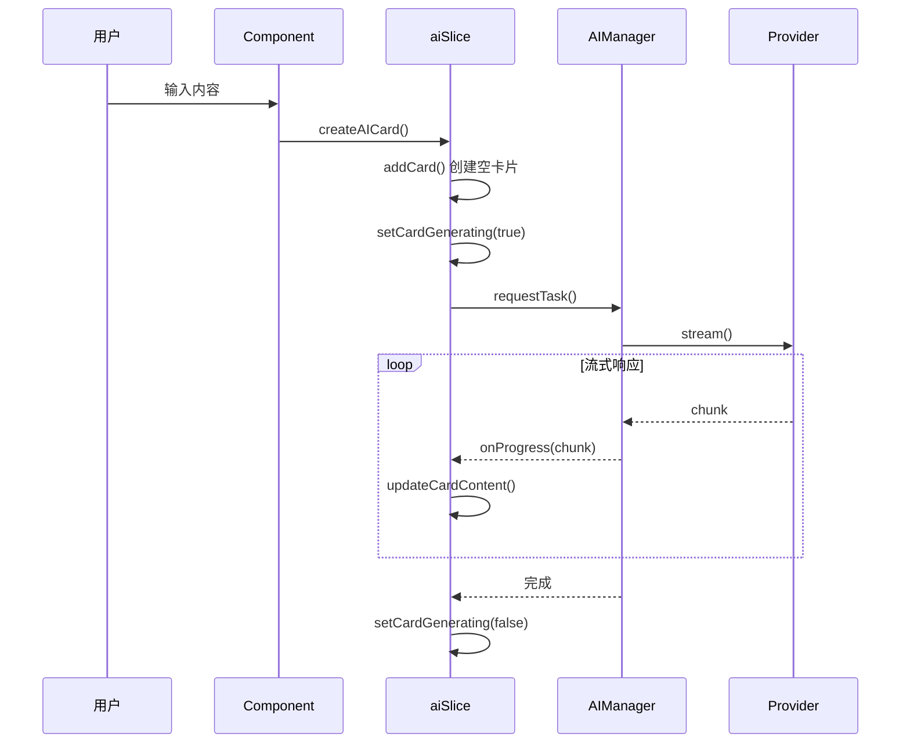

# 状态管理 (Store)

## 1. 入口文件：`useStore.js`

```javascript
// 关键特性：
// 1. 使用 Zundo temporal middleware 实现撤销/重做
// 2. 组合 9 个 Slices
// 3. 限制历史记录 50 步
// 4. 只持久化 cards, connections, groups 到历史

const useStoreBase = create(
    temporal(
        (set, get) => ({
            ...createCanvasSlice(set, get),
            ...createCardSlice(set, get),
            ...createConnectionSlice(set, get),
            // ... 其他 slices
            
            // 全局重置 (登出时调用)
            resetAllState: () => { /* 调用各 slice 的 reset */ }
        }),
        {
            limit: 50,
            partialize: (state) => ({
                cards: state.cards,
                connections: state.connections,
                groups: state.groups
            })
        }
    )
);

// 导出 undo, redo 供全局使用
export const { undo, redo, clear: clearHistory } = useStoreBase.temporal.getState();
```

## 2. Slices 详解

### 2.1 `cardSlice.js` - 卡片管理

**状态：**
```javascript
{
    cards: [],              // 所有卡片数组
    expandedCardId: null,   // 当前展开的卡片 ID
    lastSavedAt: null       // 最后保存时间
}
```

**核心 Actions：**
| Action | 描述 |
|--------|------|
| `addCard(card)` | 添加新卡片 |
| `updateCard(id, updater)` | 更新卡片 (部分更新) |
| `updateCardFull(id, updater)` | 完整更新 (用于重构后的组件) |
| `deleteCard(id)` | 删除卡片 (同时删除关联连线) |
| `arrangeCards()` | 自动布局 (树形/网格) |
| `handleCardMove(id, x, y, moveWithConnections)` | 卡片移动 |
| `resetCardState()` | 重置状态 |

**卡片数据结构：**
```javascript
{
    id: 'uuid',
    x: 0, y: 0,           // 画布位置
    type: 'conversation', // 'conversation' | 'sticky'
    data: {
        messages: [       // 对话消息列表
            { role: 'user' | 'assistant', content: '...' }
        ],
        marks: [],        // 标记的话题 (用于扩展)
        model: '...',     // 使用的模型
        provider: '...'   // 使用的 Provider
    }
}
```

### 2.2 `aiSlice.js` - AI 生成

**状态：**
```javascript
{
    generatingCardIds: new Set(),  // 正在生成的卡片 ID 集合
    // ... 其他
}
```

**核心 Actions：**
| Action | 描述 |
|--------|------|
| `createAICard(params)` | 创建新 AI 卡片并开始生成 |
| `handleChatGenerate(cardId, messages, onToken)` | 处理聊天生成 |
| `updateCardContent(id, chunk)` | 流式更新卡片内容 |
| `setCardGenerating(id, isGenerating)` | 设置生成状态 |
| `handleRegenerate()` | 重新生成选中卡片 |
| `toggleFavorite(cardId, messageIndex, content)` | 收藏消息 |

**AI 卡片创建流程：**


### 2.3 `canvasSlice.js` - 画布状态

**状态：**
```javascript
{
    offset: { x: 0, y: 0 },  // 画布偏移
    scale: 1,                 // 缩放比例
    selectedIds: [],          // 选中的卡片 IDs
    interactionMode: 'none',  // 'none' | 'pan' | 'select'
    selectionRect: null,      // 框选矩形
    isConnecting: false,      // 是否正在连接
    connectionStartId: null,  // 连接起点卡片 ID
    isBoardLoading: false     // 画板加载中
}
```

**核心 Actions：**
| Action | 描述 |
|--------|------|
| `setOffset(val)` | 设置画布偏移 |
| `setScale(val)` | 设置缩放 |
| `focusOnCard(cardId)` | 平滑聚焦到指定卡片 |
| `toCanvasCoords(viewX, viewY)` | 视口坐标转画布坐标 |
| `restoreViewport(viewport)` | 恢复视口状态 |

### 2.4 `settingsSlice.js` - 用户设置

**状态：**
```javascript
{
    providers: {           // AI 服务商配置
        'google': {
            id: 'google',
            name: 'GMI Gemini',
            baseUrl: 'https://api.gmi-serving.com/v1',
            apiKey: '',
            model: 'google/gemini-3-pro-preview',
            protocol: 'gemini',
            roles: {
                chat: '...',
                analysis: '...',
                image: '...'
            }
        },
        // 可添加更多 provider
    },
    activeId: 'google',    // 当前激活的 provider
    isSettingsOpen: false  // 设置面板是否打开
}
```

**核心 Actions：**
| Action | 描述 |
|--------|------|
| `updateProviderConfig(id, updates)` | 更新 Provider 配置 |
| `setActiveProvider(id)` | 切换激活的 Provider |
| `getActiveConfig()` | 获取当前 Provider 配置 |
| `getRoleModel(role)` | 获取指定角色的模型名 |
| `setFullConfig(config)` | 设置完整配置 (云同步用) |

**持久化：** 使用 `localStorage` key `mixboard_providers_v3`

### 2.5 `connectionSlice.js` - 连线管理

**状态：**
```javascript
{
    connections: [         // 连线数组
        { from: 'cardId1', to: 'cardId2' }
    ],
    isConnecting: false,
    connectionStartId: null
}
```

**核心 Actions：**
| Action | 描述 |
|--------|------|
| `handleConnect(targetId)` | 开始/完成连接 |
| `getConnectedCards(startId)` | 获取连接的卡片网络 |
| `setConnections(val)` | 直接设置连线 |

### 2.6 `creditsSlice.js` - 系统额度

**状态：**
```javascript
{
    systemCredits: null,        // null=未加载, number=当前额度
    systemCreditsLoading: false,
    systemCreditsError: null,
    isSystemCreditsUser: false  // 是否免费用户
}
```

**核心 Actions：**
| Action | 描述 |
|--------|------|
| `loadSystemCredits()` | 从服务器加载额度 |
| `updateCreditsFromResponse(info)` | AI 响应后更新额度 |
| `hasCredits()` | 检查是否有剩余额度 |
| `getCreditsPercentage()` | 获取额度百分比 |

### 2.7 `groupSlice.js` - 分组/Zone

**状态：**
```javascript
{
    groups: [
        {
            id: 'uuid',
            title: 'Zone Name',
            cardIds: ['card1', 'card2'],
            color: 'blue'
        }
    ]
}
```

**核心 Actions：**
| Action | 描述 |
|--------|------|
| `createGroup(cardIds, title)` | 创建分组 |
| `updateGroup(id, updater)` | 更新分组 |
| `deleteGroup(id)` | 删除分组 |
| `addConnectedCardsToZone(id1, id2)` | 连接时自动扩展分组 |

### 2.8 `boardSlice.js` - 画板元数据

**状态：**
```javascript
{
    boardPrompts: [] // 画板级提示词
}
```

**功能：** 管理当前画板特定的提示词设置。

### 2.9 `promptSlice.js` - 全局提示词

**状态：**
```javascript
{
    boardPrompts: [] // 全局常用提示词库
}
```

**功能：** 管理用户的全局提示词库（System Prompts 预设）。

### 2.10 `settingsSlice.js` (更新)

**新增状态：**
```javascript
{
    offlineMode: false,       // 离线模式 (即使有网也不上传)
    autoOfflineTriggered: false // 是否因配额耗尽自动触发
}
```

**功能：**
- `setOfflineMode(bool)`: 手动切换离线模式
- `triggerAutoOffline()`: 额度耗尽时自动降级
