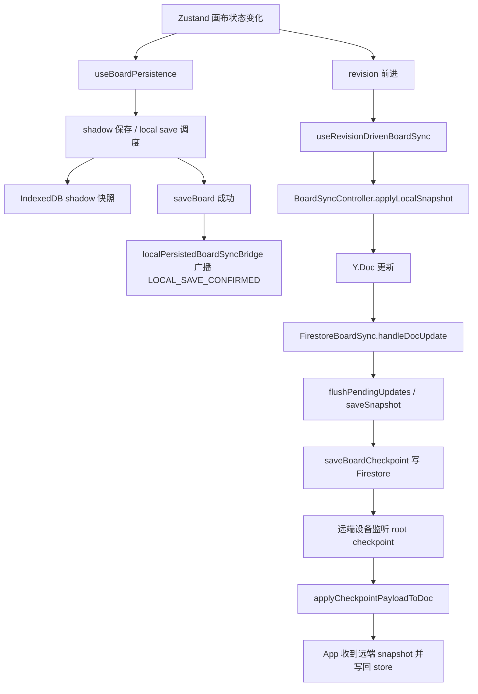

# 画布同步功能当前逻辑说明（中文）

本文档描述当前版本中，“超大画布 / 多卡片 / 长对话内容”相关的本地保存、同步控制、Y.Doc 合并、Firestore checkpoint 写入的完整处理逻辑。

本文档聚焦的功能范围：

- 画布本地保存
- 本地保存成功后如何桥接到远端同步
- BoardSyncController 如何管理本地 / 远端同步
- Firestore checkpoint 如何保存与读取
- 当前这一块为什么容易出现性能和写流问题

## 1. 相关核心文件

### 1.1 应用入口与同步桥接

- `src/App.jsx`
- `src/services/sync/localPersistedBoardSyncBridge.js`
- `src/hooks/useRevisionDrivenBoardSync.js`
- `src/hooks/useBoardChangeIntegrityMonitor.js`

职责：

- 在进入画布时创建 `BoardSyncController`
- 接收远端同步回来的 snapshot 并写回 Zustand store
- 把“保存确认”和“数据同步”彻底拆开
- `localPersistedBoardSyncBridge` 现在只表示“本地保存成功”
- `useRevisionDrivenBoardSync` 只在真实业务 revision 前进时，按独立节流把当前内容送进同步控制器
- `useBoardChangeIntegrityMonitor` 会在长时间空闲后做一次慢速完整性校验，检查“数据是否变化但 revision 没动”

### 1.2 本地持久化

- `src/hooks/useBoardPersistence.js`
- `src/services/storage.js`
- `src/services/boardPersistence/localBoardShadow.js`
- `src/services/boardPersistence/boardThumbnailStorage.js`
- `src/services/boardPersistence/boardDisplayMetadataStorage.js`
- `src/services/sync/boardThumbnailResourceSync.js`

职责：

- 监听画布状态变化
- 做本地 shadow 保存、本地 durable save、视口保存
- 影子快照现在优先写入 IndexedDB，而不是 `sessionStorage/localStorage`
- 缩略图现在优先写入独立的 IndexedDB 资源存储，而不是继续内联在高频 metadata 正文里
- 缩略图资源现在拆成“两层”：
  - metadata 只保存 `thumbnailRef / thumbnailUpdatedAt`
  - 实际缩略图数据保存在独立资源层，本地优先落 IndexedDB，远端用独立 Firestore 缩略图资源文档兜底
- 在 `saveBoard` 成功后，只广播保存确认信号，不广播整份 payload

### 1.3 同步控制层

- `src/services/sync/boardSyncController.js`

职责：

- 持有当前画布的 Y.Doc
- 管理 IndexedDB 持久化
- 管理 Firestore 同步实例
- 把本地保存成功的 snapshot 应用到 Y.Doc

### 1.4 Y.Doc 映射与卡片合并

- `src/services/sync/boardYDoc.js`
- `src/services/sync/boardSnapshot.js`

职责：

- 把 board snapshot 映射为 Yjs 文档结构
- 处理 cards 的按 `card.id` 合并
- 处理文本字段的 `Y.Text` diff 更新
- 编码紧凑 checkpoint

### 1.5 Firestore 同步与 checkpoint 存储

- `src/services/sync/firestoreBoardSync.js`
- `src/services/sync/firestoreCheckpointStore.js`
- `src/services/sync/checkpointCompatibility.js`
- `src/services/sync/remoteCheckpointRepairPlanner.js`

职责：

- 监听远端 checkpoint
- 把本地 Y.Doc update 写到远端
- 维护 checkpoint 的 inline / chunked 存储
- 兼容历史 checkpoint 格式

## 2. 当前整体流程

## 3. 进入画布时发生了什么

入口文件：`src/App.jsx`

处理顺序：

1. 根据 `currentBoardId` 加载本地画布数据。
2. 调用 `applyBoardSnapshotToStore(data, { source: 'local_load' })`，把本地数据写进 Zustand。
3. 创建 `BoardSyncController`。
4. 调用 `syncController.start(data, { expectedCardCount })`。

`BoardSyncController.start()` 里会做的事：

1. 创建新的 `Y.Doc`
2. 绑定 `IndexeddbPersistence`
3. 读取当前 doc 中的持久化内容
4. 判断是否需要把本地 snapshot 灌进 doc
5. 创建 `FirestoreBoardSync`
6. 调用 `fireSync.connect()`
7. 如果远端为空且本地不为空，执行一次 `initial_local_seed`
8. 如果远端不为空，则读取远端 checkpoint，并尝试必要的延迟修复计划

## 4. 本地编辑时发生了什么

入口文件：`src/hooks/useBoardPersistence.js`

当前版本新增了一层核心机制：

- `src/store/slices/utils/boardChangeState.js`

它的职责不是“拍整板快照做比较”，而是直接追踪真正的业务变化。

当前 revision 追踪规则：

- 会递增 revision：
  - 编辑卡片内容
  - 新增 / 删除 / 恢复卡片
  - 移动卡片位置
  - 连线变化
  - 分组变化
  - board prompts / board instruction settings 变化
- 不会递增 revision：
  - 视口平移 / 缩放
  - 选中、悬停等 UI 状态
  - 同步层内部状态

当前版本为了保证 revision 的可靠性，又新增了三条规则：

1. 所有真正的数据改动路径都必须走统一的 `bumpBoardChangeState(...)`
   - 包括 `aiSlice` 的流式落盘、assistant meta 写入、重新生成
   - 包括批量删除、网格整理
   - 包括 prompts / instruction settings / cards / connections / groups

2. `undo / redo` 不会回退到旧 revision
   - 数据回到旧内容后，revision 仍然继续递增
   - 同时记录 `lastChangeType = undo | redo`
   - 撤销重做后的当前整板内容会重新计算完整性 hash，作为新的验证基线

3. 低频完整性校验
   - 画布空闲 5 分钟后，会在浏览器空闲时段重新计算一次整板完整性 hash
   - 如果发现“tracked data 已变，但 lastValidatedRevision 仍等于当前 revision”，说明有路径漏掉了 revision 递增
   - 这时系统会自动执行一次 `integrity_repair`
   - 修复方式是：递增 revision，并把当前整板内容写成新的验证基线

这意味着：

- `useBoardPersistence` 不再依赖“整板 `JSON.stringify` 指纹”判断变化
- 而是只看 `boardChangeState.revision`
- 真正需要完整 snapshot 时，才构造 payload

这个 hook 仍然拿到当前 board 数据，但真正触发保存调度的关键条件，已经变成：

- `boardChangeState.revision`
- `lastExternalSyncMarker.versionKey`
- `activeBoardPersistence`

当 revision 前进时：

1. 构造当前 payload
2. 计算当前 revision
3. 更新 `latestBoardDataRef`
4. 标记 `activeBoardPersistence.dirty = true`
5. 调度两类保存：
   - shadow 保存
   - local durable save

其中：

- shadow 保存更快，目的是兜底恢复
- durable save 走真正的 `saveBoard(boardId, payload)`
- “是否有变化”现在是 O(1) 的 revision 判断，不再是整板深拷贝 + `JSON.stringify`
- shadow 快照现在写入 IndexedDB，并带 `clientRevision / updatedAt` 保护，避免旧影子快照反盖新影子快照

### 4.1 本地保存成功事件现在只做什么

这是当前版本里最关键的一点之一。

以前的错误做法是：

- `saveBoard` 成功
- 发事件
- `App.jsx` 收到后直接 `applyLocalSnapshot(整份 snapshot)`
- 把“保存确认”错误当成了“同步指令”

现在的做法是：

1. `performLocalSave()` 成功后，已经拿到一份真正写入本地存储的 `payload`
2. `useBoardPersistence.js` 只调用 `emitLocalSaveConfirmed({ boardId, clientRevision, savedAt, source })`
3. 这个事件现在只表示“本地保存已确认落地”
4. 它不再触发任何数据级同步操作

这意味着：

- 保存确认和数据同步已经解耦
- 本地保存成功不再导致整板 snapshot 再次走同步控制器

### 4.2 revision 可靠性现在如何保证

文件：

- `src/store/slices/utils/boardChangeState.js`
- `src/store/slices/utils/boardChangeIntegrity.js`
- `src/store/useStore.js`
- `src/hooks/useBoardChangeIntegrityMonitor.js`

当前版本中，revision 的可靠性保护分成三层：

1. 统一递增入口
   - 所有业务数据变更都统一通过 `bumpBoardChangeState`
   - 不再允许局部绕过 revision 逻辑直接改 tracked board data

2. undo / redo 包装层
   - `useStore.js` 不再直接导出 zundo 的原始 `undo/redo`
   - 现在撤销/重做后，会立即：
     - 重建卡片查找缓存
     - 刷新 `cardIndexMutation`
     - 递增 revision
     - 记录 `undo/redo` 变更类型
     - 重新写入当前完整性 hash
   - `zundo` 的 equality 现在也不再只比较 `cards / connections`
   - `groups / boardPrompts / boardInstructionSettings` 也纳入了撤销历史判定

3. 慢速完整性校验
   - 在没有生成任务、画布也不在加载时
   - 空闲 5 分钟后才做一次整板 hash 比较
   - 这不是高频逻辑，不参与每次保存/同步判断
   - 它的职责只是兜底发现“真实数据变了，但 revision 没动”

### 4.3 影子快照现在如何保存和迁移

文件：`src/services/boardPersistence/localBoardShadow.js`

当前版本中，影子快照的处理规则已经改成：

1. 新写入路径：
   - 不再写 `sessionStorage/localStorage`
   - 统一写入 IndexedDB 主 store，使用独立 key 前缀保存 shadow 记录

2. 写入保护：
   - 每次影子快照写入都会带 `clientRevision` 和 `updatedAt`
   - 如果当前库里已经有更新或相同版本的 shadow，就拒绝旧写入覆盖

3. 并发顺序保护：
   - 同一张 board、同一 scope 的 shadow 写入使用串行队列
   - 这样可以避免 “A 版本后发先至，B 版本先发后至，最终旧数据覆盖新数据” 的竞态

4. 页面关闭/冻结时的可靠性：
   - `shadow` 本身不再产生新的 `sessionStorage/localStorage` 写入
   - 在 `pagehide / beforeunload / freeze / unmount` 这类 critical flush 时
   - 会由 `emergencyLocalSave` 同步写一份主 board fallback 到 legacy `mixboard_board_*`
   - 也就是说，影子快照的职责已经收口为“纯 IndexedDB 恢复层”
   - Web Storage 只剩主 board 的同步兜底，不再继续承担 shadow 的新写入

5. 迁移层：
   - 读取时先查 IndexedDB
   - 如果 IndexedDB 没有，再查旧的 `sessionStorage/localStorage`
   - 如果读到了旧影子快照，会先尝试写入 IndexedDB
   - 只有 IndexedDB 写成功后，才清理旧位置的数据
   - 如果迁移失败，则保留旧数据，不做删除

6. 清理策略：
   - durable save 成功后，shadow 会被异步清理
   - 清理时同时删 IndexedDB shadow 和旧 Web Storage 遗留项

### 4.4 缩略图现在如何保存和迁移

文件：

- `src/services/boardPersistence/boardThumbnailStorage.js`
- `src/services/boardPersistence/boardThumbnailMigration.js`
- `src/services/boardPersistence/boardDisplayMetadataStorage.js`
- `src/hooks/useAppInit.js`
- `src/services/sync/boardMetadataSync.js`
- `src/components/BoardCard.jsx`

当前版本中，缩略图已经不再被设计成 metadata 正文的大字段，而是拆成：

1. 资源层：
   - 缩略图 data URL 写入 IndexedDB 独立 key
   - key 由 `boardId + hash + length` 组成

2. metadata 层：
   - board metadata 只保留 `thumbnailRef`
   - 可选保留 `thumbnailUpdatedAt`
   - legacy `thumbnail` 字段只作为迁移输入，不再作为新的持久化输出

3. 显式迁移层：
   - 如果旧 board payload、旧 boards list、或远端 metadata 里还存在内联 `thumbnail`
   - 现在统一先走 `boardThumbnailMigration.js`
   - 迁移顺序是：
     - 检测旧格式
     - 先把 data URL 写入 IndexedDB 独立资源层
     - 如果需要，再补远端独立缩略图资源文档
     - 只有新资源写成功，才返回 `thumbnailRef / thumbnailUpdatedAt`
     - 只有迁移成功，后续持久化时才会删除 legacy `thumbnail`
   - 如果迁移失败：
     - 保留旧的内联 `thumbnail`
     - 不会删旧字段
     - 列表和详情页仍然可以继续走 legacy 兜底显示

4. 读取层：
   - `BoardCard` 不再直接依赖 `board.thumbnail`
   - 它会优先读取 `board.backgroundImage`
   - 否则按 `thumbnailRef` 到 IndexedDB 里取本地缩略图资源
   - legacy `board.thumbnail` 只作为兼容兜底

5. 远端 metadata 层：
   - Firestore metadata 同步现在发 `thumbnailRef / thumbnailUpdatedAt`
   - 同时显式删除旧的 `thumbnail` 内联字段

6. 启动和远端加载入口：
   - `useAppInit` 会在本地 boards list 初始化时先跑一次显式缩略图迁移
   - `loadRemoteBoardMetadataList` 会在远端 metadata 拉取后先跑一次显式缩略图迁移
   - 这样旧格式不会因为“新代码只认 `thumbnailRef`”而直接出现缩略图空白

### 4.2 现在真正谁来驱动同步

文件：`src/hooks/useRevisionDrivenBoardSync.js`

当前版本中，远端同步的触发条件已经改成：

- `boardChangeState.revision` 前进
- 当前画布不在 loading
- 当前没有卡片正在流式生成
- `BoardSyncController` 已就绪
- `lastChangeType` 属于真实业务变更，而不是 `sync_apply / local_load / manual_force_override`

触发后，会按 change type 做独立同步节流：

- `card_content`：更保守
- `card_move`：更保守
- `card_add / delete / restore / connection / group / prompt / instruction`：更快

然后才会把当前 live board 内容组装成 snapshot，交给 `controller.applyLocalSnapshot(...)`。

也就是说：

- 现在是“数据变化驱动同步”
- 不是“保存成功驱动同步”

## 5. BoardSyncController 当前怎么处理本地 snapshot

文件：`src/services/sync/boardSyncController.js`

本地 snapshot 进入控制器后，当前逻辑是：

1. `normalizeBoardSnapshot(nextSnapshot)`
2. 读取当前 doc 的 snapshot：`readBoardSnapshotFromDoc(this.doc)`
3. 判断当前 doc 是否为空
4. 判断新的 snapshot 是否为空
5. 判断新的 snapshot 是否比当前 doc 更新

然后分两条分支：

### 5.1 新 snapshot 比 doc 新

调用：

- `syncBoardSnapshotToDoc(this.doc, normalized)`

也就是把整份 board snapshot 同步进 doc。

### 5.2 新 snapshot 不比 doc 新

当前版本里，这种情况会直接拒绝回灌，不再做任何 `cards fallback`。

也就是说：

- 本地 snapshot 如果不比当前 doc 新
- 就不能再把一份可能不完整的本地 `cards` 强行灌回 Y.Doc

这样做的目的，是防止“新设备本地旧快照”在远端还没完全补齐前，就过早参与同步，形成隐性的本地高优先级。

## 6. Y.Doc 当前是如何组织和合并的

文件：`src/services/sync/boardYDoc.js`

Y.Doc 的根键包括：

- `cards`
- `connections`
- `groups`
- `boardPrompts`
- `boardInstructionSettings`
- `updatedAt`
- `clientRevision`

### 6.1 cards 的合并规则

当前 cards 不是按整个数组粗暴覆盖，而是按 `card.id` 合并。

优先级大致是：

1. 显式删除态 `deletedAt`
2. 对话轮数更多优先
3. 消息条数更多优先
4. 文本总长度更完整优先
5. `updatedAt` 更新的优先

这意味着：

- 少卡不会天然覆盖多卡
- 缺失卡片不会被自动当删除
- 只有显式 `deletedAt` 才允许删除态生效

### 6.2 文本字段的处理

部分路径使用 `Y.Text`：

- 卡片标题
- 卡片摘要
- `messages[*].content`
- prompt 文本

字符串更新使用 `fast-diff` 的 patch 应用，而不是每次整段替换。

### 6.3 checkpoint 编码

当前 checkpoint 编码使用：

- `encodeCompactBoardSnapshotUpdate(source)`

它会：

1. 先从 snapshot 或 doc 读取当前可见内容
2. 新建临时干净 doc
3. 把 snapshot 灌进去
4. 再 `Y.encodeStateAsUpdate(tempDoc)`

这一步的目的，是避免把长期存活 live doc 中的历史结构直接写进 checkpoint。

## 7. Firestore 当前怎么写入

文件：`src/services/sync/firestoreBoardSync.js`

### 7.1 本地 doc 更新后的处理

当前 `handleDocUpdate(update, origin)` 会忽略：

- `firestore`
- `indexeddb`

其余 origin 的 doc 更新都会进入：

1. `pendingUpdates.push(update)`
2. `pendingBytes += update.byteLength`
3. `scheduleFlush()`

### 7.2 flush 的两种触发方式

1. `pendingBytes >= maxPendingBytes`
   - 直接 `flushPendingUpdates('size_limit')`
2. 没超阈值
   - 等 debounce 计时器到时再 flush

### 7.3 当前为什么大画布容易直接触发 size_limit

因为当一次 `applyLocalSnapshot()` 导致的 Y.Doc update 太大时：

- 不会等 debounce
- 会立刻进入 `flushPendingUpdates('size_limit')`

当前版本默认 `updateLogEnabled = true`，优先走增量 update log：

1. 把本次合并后的 update 写到 `updates` 子集合
2. 再写 root 文档里的 `syncTouchedAtMs`
3. 每累计一定 flush 次数后，再做周期性 checkpoint 压实

只有当 update log 写入失败时，才会退回：

- `saveSnapshot('updates_fallback')`

也就是重新写整板 checkpoint。

### 7.4 root 文档现在不仅是 checkpoint 指针，也是“增量补拉信号”

这是当前版本里修掉的一个关键根因。

之前的问题是：

- 设备 A 写出新的 `updates` 文档后，会顺手更新 root 里的 `syncTouchedAtMs`
- 设备 B 的 root 监听如果发现“checkpoint key 没变”，就会直接 return
- 结果这个“远端其实有新增量了”的信号被吞掉
- 一旦 B 端的 tail listener 或首次 tail load 恰好错过窗口，就会表现成“同一画布、同一卡片，在另一台设备上就是不同步”

当前版本的处理变成：

- root 监听除了比较 checkpoint key / checkpointSavedAtMs
- 还会额外比较 `syncTouchedAtMs`
- 如果 checkpoint 没变，但 `syncTouchedAtMs` 前进了
- 就会主动执行一次 `loadTailUpdates()` 做增量补拉

这意味着：

- root 现在承担两层职责
- 一层是 checkpoint 指针
- 一层是“有新 delta 可以补拉”的广播信号

## 8. Firestore checkpoint 当前怎么存

文件：`src/services/sync/firestoreCheckpointStore.js`

当前 checkpoint 有两种模式：

### 8.1 inline

如果 `byteLength <= INLINE_CHECKPOINT_MAX_BYTES`

- 直接把 `checkpointBase64` 存到 root 文档

### 8.2 chunked

如果超过 inline 阈值：

1. 创建 checkpoint set
2. 把 base64 按 part 分片
3. 批量写入 parts collection
4. 再更新 root 文档指向新的 checkpoint set

当前参数：

- `INLINE_CHECKPOINT_MAX_BYTES = 900KB`
- `TARGET_PART_BYTES = 800KB`
- `MAX_PART_BYTES = 900KB`

注意：

- 这里减少了 part 数量
- 但它只能减少“单次 checkpoint 的文档数量”
- 不能解决“为什么 checkpoint 被触发得太频繁”

## 9. 当前最容易出 BUG / 放大的点

这是理解这块功能的重点。

### 9.1 逻辑上按卡片合并，执行上仍然有整板级路径

虽然 cards 冲突解决是按 `card.id` 合并，
但以下步骤很多仍然是整板级：

- 构造 board snapshot
- normalize snapshot
- 计算 fingerprint
- applyLocalSnapshot
- saveSnapshot

### 9.2 `createBoardSnapshotFingerprint()` 成本高

文件：`src/services/sync/boardSnapshot.js`

当前 fingerprint 实现是：

- `JSON.stringify(normalizedSnapshot)`

对大画布、大对话来说，这本身就很重。

### 9.3 `applyLocalSnapshot()` 当前仍然不是脏卡片级 patch

文件：`src/services/sync/boardSyncController.js`

即使现在把桥接改成“本地保存成功后再桥接”，
控制器内部仍然会：

- 读取当前整板 snapshot
- 再决定是否整板同步

虽然“本地不够新却仍回灌整份 cards”的错误逻辑已经移除，
但它仍然不是“只同步局部脏卡”。

### 9.4 Firestore 远端写入仍然和整板 checkpoint 强绑定

当前一旦 doc update 足够大，就会直接触发整板 checkpoint 写入。

这意味着：

- 大画布只要一有较大的局部变化
- 就很容易从“局部变化”被放大成“整板 checkpoint 写入”

## 10. 当前版本和之前版本的差异

本文档对应的当前逻辑，相比前面的失败方案，最大的变化是：

- 已经不再让 `App.jsx` 从 live store 持续构造整板 snapshot 并桥接远端同步
- 改成只在本地 `saveBoard` 成功后，再桥接那份已保存成功的 payload

这一步减少了一个很重要的放大器，但并不意味着整块同步系统已经彻底变成“脏卡片级”。

## 11. 如果后续继续重构，最合理的方向

如果以后继续改这一块，最合理的方向不是继续调 Firestore 参数，而是：

1. 把 `BoardSyncController.applyLocalSnapshot()` 从“整板 / 整份 cards 合并”继续拆成“脏卡片级 patch”
2. 降低或替换 `createBoardSnapshotFingerprint()` 对大对象的 `JSON.stringify`
3. 让远端 checkpoint 保存频率和本地 durable save 频率进一步解耦
4. 明确区分：
   - 本地保存
   - 协作状态维护
   - 远端 checkpoint 落库

## 12. 当前新增的“强制覆盖所有设备”按钮逻辑

这是为了给用户一个明确、可控的兜底入口。

入口位置：

- 桌面端画布顶栏
- 移动端画布头部

点击后当前版本的执行顺序是：

1. 用户确认要以当前设备内容为准
2. 立即把当前设备 store 里的整张画布重新组织成 snapshot
3. 强制写一次本地 `saveBoard`
4. 更新当前设备的 `activeBoardPersistence`
5. 通过 `BoardSyncController.forceOverwriteFromSnapshot()` 把这份 snapshot 直接写进当前 Y.Doc
6. 跳过普通本地 update 队列，直接执行一次 `saveSnapshot('manual_force_override')`
7. 远端 root checkpoint 被替换，其他设备后续加载这张画布时，会以这份 checkpoint 为准

这一条链的目的不是优化自动同步，而是给用户一个“手动宣布当前设备为准版本”的硬覆盖操作。

## 13. 用一句话总结当前逻辑

当前这块功能的真实执行逻辑可以概括为：

`本地编辑 -> useBoardPersistence 调度并完成本地保存 -> 通过桥接模块把“已保存 payload”交给同步控制器 -> 控制器把更新版本的 snapshot 应用到 Y.Doc -> Firestore 同步层优先写 delta update log，并用 root.syncTouchedAtMs 通知别的设备补拉 -> 必要时再做 checkpoint 压实 -> 远端设备补拉 delta 或回放 checkpoint 到本地。`

而当前这块最核心的风险仍然是：

`虽然冲突语义已经部分按卡片处理，但在计算和远端写入路径上，系统仍然保留了明显的整板级特征。`
